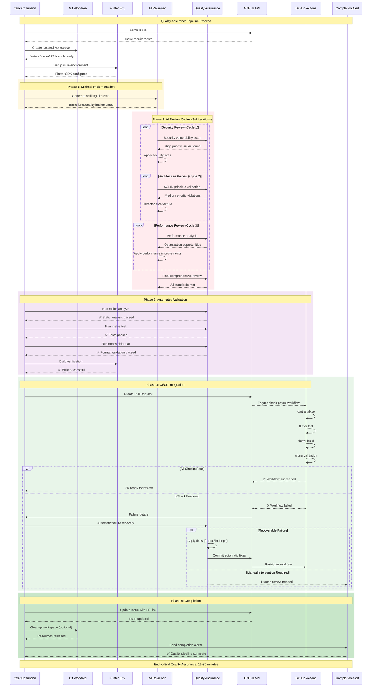

# GitHub Issue Processing Command - Claude 4 Best Practices & TDD Integration

**IMPORTANT**: This command implements TDD + AI Review-First design following Claude 4 best practices and Test-Driven Development principles for high-quality Flutter development using GitHub Issues.

## Overview

Process GitHub Issues using TDD + AI Review-First methodology. This command creates isolated work environments, applies Red-Green-Refactor cycles with structured AI review integration, and ensures quality standards through automated validation.

## Core Principles (Claude 4 + TDD Best Practices)

**References**:

- `docs/CLAUDE_4_BEST_PRACTICES.md`
- `docs/TEST_DRIVEN_DEVELOPMENT.md`

### TDD + AI Review-First Methodology

- **Core Cycle**: Red (failing test) → Green (minimal implementation) → AI Review → Refactor → Release
- **30% Test Strategy**: Start with minimal failing tests, implement to pass, then improve through AI review
- **Approach**: Use AI as "Senior Reviewer" for TDD cycles, not "Junior Designer"
- **Review Cycles**: 3-4 iterative AI review cycles during Refactor phase
- **Priority Order**: Security (HIGH) → SOLID Principles (MEDIUM) → Performance (LOW)

### F.I.R.S.T. Principles Integration

- **F**ast: Tests execute in < 0.1 seconds
- **I**ndependent: Tests don't depend on each other
- **R**epeatable: Consistent results across environments
- **S**elf-validating: Clear pass/fail outcomes
- **T**imely: Tests written before implementation

### Clear Instructions with TDD Context

- Eliminate ambiguity in test requirements and implementation goals
- Define specific TDD acceptance criteria and quality gates
- Provide structured AI review templates for Red-Green-Refactor cycles

### Structured Quality Assessment with TDD Focus

Apply consistent TDD + AI evaluation framework:

```
1. Test Quality (F.I.R.S.T. compliance) - validation phase
2. Security vulnerabilities (HIGH PRIORITY) - AI review phase
3. SOLID principle violations (MEDIUM PRIORITY) - AI review phase
4. Performance optimization (LOW PRIORITY) - AI review phase
Constraint: Summarize findings within 400 characters per category
```

## Execution Modes

### Interactive Mode (No Arguments)

```bash
/task
```

**Behavior**:

1. Fetch Issues from GitHub using `gh issue list --assignee @me --state open`
2. Parse and categorize Issues by type:
   - **Features**: Labels containing 'enhancement', 'feature'
   - **Bugs**: Labels containing 'bug', 'bugfix'
3. Display interactive selection with Issue Template compliance indicators
4. Support multiple Issue selection with TDD readiness validation
5. Confirm selections before parallel TDD + AI Review-First execution

### Automatic Mode (With Arguments)

```bash
/task #123 #456
```

**Behavior**:

- **No confirmation prompts** - immediate TDD + AI Review-First execution
- Validate Issue numbers and template compliance via `gh issue view`
- Check Issue Template fields (acceptance criteria, testing strategy, AI review criteria)
- Create isolated TDD work environments automatically via git worktree
- Begin background processing with Red-Green-Refactor + AI Review cycles
- Send completion notifications with TDD quality metrics

## TDD + AI Review-First Processing Flow

### Phase 1: Red - Failing Test Creation (5 minutes)

**Objective**: Create minimal failing tests following F.I.R.S.T. principles

**TDD Actions**:

- Parse Issue Template acceptance criteria and testing strategy
- Configure Flutter test environment using `mise`
- Create dedicated feature branch via `git worktree add .claude-workspaces/issue-{number}/`
- Write 30% tests: single behavior, minimal expectations
- Validate Issue Template compliance (functional/non-functional/security requirements)

**Quality Gates**:

- ✅ Tests fail as expected (Red state confirmed)
- ✅ Test intent clear without implementation
- ✅ F.I.R.S.T. principles followed
- ✅ Issue Template requirements translated to test cases

### Phase 2: Green - Minimal Implementation (10 minutes)

**Objective**: Make tests pass with simplest possible implementation

**Implementation Strategy Selection**:

- **Obvious**: Clear, direct implementation
- **Fake It**: Hard-coded values, then generalize
- **Triangulation**: Multiple test cases to drive abstraction

**Quality Gates**:

- ✅ All tests pass (Green state achieved)
- ✅ Minimal code changes applied
- ✅ No over-engineering or premature optimization
- ✅ Compilable, functional walking skeleton

### Phase 3: Refactor - AI Review Cycles (15 minutes, 3-4 Iterations)

**Objective**: Improve code quality through structured AI review while maintaining test success

**TDD + AI Review Template** (Use this exact format):

```
Code Review Request: [Brief description]

Implement TDD + AI Review-First methodology:

1. Test Quality Validation (F.I.R.S.T. compliance):
   - Fast: < 0.1 seconds execution
   - Independent: No test interdependencies
   - Repeatable: Consistent results
   - Self-validating: Clear pass/fail
   - Timely: Written before implementation

2. Security Analysis (HIGH Priority - Fix Immediately):
   - Hardcoded secrets/credentials scan
   - Input validation and sanitization
   - Secure data storage patterns
   - Authentication/authorization security

3. Architecture Review (MEDIUM Priority - Address Next):
   - SOLID principles compliance (SRP, OCP, LSP, ISP, DIP)
   - Design pattern consistency with project conventions
   - Code organization and separation of concerns
   - Error handling and user feedback patterns

4. Performance Review (LOW Priority - Optimize Later):
   - Algorithmic efficiency and O(n) complexity
   - Resource usage: memory, CPU, network
   - Flutter-specific: widget rebuilds, state management
   - Build performance and dependency impact

Constraints:
- Maximum 400 characters per category summary
- Provide specific file:line references
- Include actionable next steps
- Maintain test success throughout refactoring
```

**Iterative AI Review Process**:

1. **Cycle 1**: Validate F.I.R.S.T. test quality + address ALL HIGH priority security issues
2. **Cycle 2**: Fix major SOLID principle violations while preserving test success
3. **Cycle 3**: Optimize performance within feasible scope, validate test performance
4. **Final Validation**: Human review of AI recommendations + full test suite execution

**TDD Quality Gates**:

- ✅ **Test Integrity**: All tests continue to pass after each refactor iteration
- ✅ **Security**: Zero high-severity vulnerabilities identified
- ✅ **Architecture**: Major SOLID principle violations resolved
- ✅ **Performance**: Test execution < 0.1s, no obvious bottlenecks
- ✅ **F.I.R.S.T. Compliance**: All tests meet independence, repeatability criteria

### Phase 4: Release Preparation with TDD Validation

**TDD Release Actions**:

- Execute complete TDD validation suite:
  ```bash
  melos run test              # All tests (unit, widget, integration)
  melos run analyze          # Static analysis (dart analyze)
  melos run format           # Code formatting (dart format)
  melos run analyze-slang    # Translation validation
  ```
- Verify F.I.R.S.T. compliance: test independence, speed, repeatability
- Run TDD quality metrics: cycle time (Red: 5min, Green: 10min, Refactor: 15min)
- Generate test coverage report and ensure quality thresholds met
- Create Pull Request with Issue Template-compliant description
- Monitor GitHub Actions: `.github/workflows/check-pr.yml`
- Update GitHub Issue with TDD metrics and completion status
- Send completion notification with TDD quality metrics summary

**TDD Quality Gates**:

- ✅ **Complete Test Suite**: All Red-Green-Refactor cycles completed successfully
- ✅ **F.I.R.S.T. Compliance**: All tests meet speed, independence, repeatability criteria
- ✅ **Test Coverage**: Unit tests ≥90%, Widget tests ≥80%, Critical paths 100%
- ✅ **AI Review Standards**: All security, SOLID, performance criteria met
- ✅ **CI/CD Pipeline**: All GitHub Actions checks pass including test execution
- ✅ **Issue Template Compliance**: All acceptance criteria validated and documented

## GitHub CLI Integration (Unified Approach)

**IMPORTANT**: All GitHub operations MUST use GitHub CLI (`gh`) commands. Direct GitHub API calls are deprecated.

### Issue Management Commands

```bash
# List issues with Issue Template compliance check
gh issue list --assignee @me --state open --json number,title,labels,body

# Get issue details with template field validation
gh issue view #123 --json body,title,labels | jq '.body' | grep -E "(Acceptance Criteria|Testing Strategy|AI Review)"

# Issue Template compliance validation
gh issue view #123 --json body | jq -r '.body' | grep -c "- \[ \]" # Count unchecked checkboxes

# Add TDD progress comment with metrics
gh issue comment #123 --body "TDD Progress: Red(5min) → Green(10min) → Refactor(15min). F.I.R.S.T. compliance: ✅"

# Close issue with TDD completion metrics
gh issue close #123 --comment "Fixed in PR #456. TDD Metrics: Tests(90%+), Security(✅), SOLID(✅), Performance(✅)"
```

### Issue Template Field Extraction

```bash
# Extract acceptance criteria from Issue Template
gh issue view #123 --json body | jq -r '.body' | sed -n '/### Acceptance Criteria/,/###/p' | grep -v "###"

# Extract testing strategy requirements
gh issue view #123 --json body | jq -r '.body' | sed -n '/### Testing Strategy/,/###/p' | grep "- \[ \]"

# Extract AI review criteria
gh issue view #123 --json body | jq -r '.body' | sed -n '/### AI Review-First Quality Criteria/,/###/p'

# Validate required Issue Template fields
gh issue view #123 --json body | jq -r '.body' | grep -E "(Functional Requirements|Security Requirements|Testing Strategy)" || echo "❌ Issue Template incomplete"
```

### Pull Request Creation with Issue Template Compliance

```bash
# Determine PR template based on issue labels
ISSUE_LABELS=$(gh issue view #123 --json labels | jq -r '.labels[].name')
if echo "$ISSUE_LABELS" | grep -q "enhancement\|feature"; then
    TEMPLATE=".github/PULL_REQUEST_TEMPLATE/feature.md"
elif echo "$ISSUE_LABELS" | grep -q "bug\|bugfix"; then
    TEMPLATE=".github/PULL_REQUEST_TEMPLATE/bugfix.md"
else
    TEMPLATE=".github/PULL_REQUEST_TEMPLATE.md"
fi

# Create PR with Issue Template compliance validation
gh pr create \
  --title "$(gh issue view #123 --json title | jq -r '.title') [#123]" \
  --body "$(cat <<EOF
## Issue Template Compliance
✅ Acceptance Criteria: $(gh issue view #123 --json body | jq -r '.body' | grep -c '✅.*Acceptance')
✅ TDD Implementation: Red-Green-Refactor cycles completed
✅ F.I.R.S.T. Principles: All tests meet Fast, Independent, Repeatable, Self-validating, Timely criteria
✅ AI Review Cycles: 3-4 iterations completed (Security → SOLID → Performance)

## TDD Quality Metrics
- Test Coverage: Unit(≥90%), Widget(≥80%), Critical(100%)
- Cycle Time: Red(5min), Green(10min), Refactor(15min)
- F.I.R.S.T. Compliance: $(test_first_compliance_score)
- AI Review Standards: Security(✅), SOLID(✅), Performance(✅)

Closes #123
EOF
)"

# Monitor PR status and Issue Template validation
gh pr view --json checks,reviews | jq '.checks[] | select(.name == "check-pr") | .status'
```

## TDD + AI Review-First Completion Criteria

Task completion requires ALL conditions met following TDD + AI Review-First methodology:

### 1. TDD Cycle Completion Standards

- ✅ **Red Phase**: All failing tests created following F.I.R.S.T. principles
- ✅ **Green Phase**: Minimal implementation achieves test success
- ✅ **Refactor Phase**: 3-4 AI review cycles completed successfully with test integrity maintained
- ✅ **Test Quality**: F.I.R.S.T. compliance validated (Fast < 0.1s, Independent, Repeatable, Self-validating, Timely)

### 2. AI Review-First Quality Standards

- ✅ **Security Review**: All HIGH priority vulnerabilities resolved (hardcoded secrets, input validation, secure storage)
- ✅ **SOLID Principles**: MEDIUM priority architectural issues fixed (SRP, OCP, LSP, ISP, DIP compliance)
- ✅ **Performance Review**: LOW priority optimization opportunities addressed (algorithm efficiency, resource usage)
- ✅ **Review Constraint**: Each category summary ≤ 400 characters with actionable feedback

### 3. Issue Template Compliance Standards

- ✅ **Acceptance Criteria**: All Issue Template acceptance criteria validated and met
- ✅ **Testing Strategy**: Issue Template testing requirements implemented and verified
- ✅ **AI Review Criteria**: Issue Template AI review criteria satisfied with documented results
- ✅ **Security Requirements**: Issue Template security requirements validated and implemented

### 4. Quality Gate Validation

- ✅ **Test Coverage**: Unit tests ≥90%, Widget tests ≥80%, Critical paths 100%
- ✅ **TDD Metrics**: Red(≤5min), Green(≤10min), Refactor(≤15min) cycle times achieved
- ✅ **Static Analysis**: `melos run analyze` passes with zero warnings/errors
- ✅ **Code Formatting**: `melos run format` applied and validated
- ✅ **Translation Validation**: `melos run analyze-slang` passes for i18n compliance

### 5. Release Readiness with TDD Documentation

- ✅ **Pull Request**: Created with Issue Template compliance validation and TDD metrics
- ✅ **CI/CD Pipeline**: All GitHub Actions checks successful including test execution
- ✅ **Issue Management**: GitHub Issue updated with TDD completion metrics and PR reference
- ✅ **TDD Documentation**: F.I.R.S.T. compliance report and AI review cycle summary included

### 6. Failure Recovery with TDD Validation

- ✅ **Test Integrity**: Automatic correction maintains test success throughout recovery
- ✅ **Quality Assurance**: Re-validation includes full TDD cycle verification
- ✅ **F.I.R.S.T. Recovery**: Failed tests maintain independence and repeatability during fixes

## GitHub Actions Integration

### Quality Assurance Pipeline

**Comprehensive Quality Framework**: Multi-stage validation ensuring production-ready code through automated and manual quality gates.



#### Stage 1: Code Quality Analysis

**Flutter-Specific Checks**:

```bash
# Static analysis with Flutter rules
melos run analyze
dart analyze --fatal-infos --fatal-warnings

# Format validation
melos run ci:format
dart format --set-exit-if-changed .

# Translation validation
melos run analyze:slang
```

**Quality Metrics**:

- Zero analyzer warnings/errors
- 100% code formatting compliance
- All translation keys validated

#### Stage 2: Security Assessment

**Automated Security Scan**:

```bash
# Dependency vulnerability check
flutter pub deps --json | jq '.packages[] | select(.kind == "direct")'

# Sensitive data detection
grep -r "API_KEY\|SECRET\|PASSWORD" --exclude-dir=.git .
```

**Security Checklist**:

- ✅ No hardcoded secrets or API keys
- ✅ Proper input validation and sanitization
- ✅ Secure data storage practices
- ✅ Network security implementation

#### Stage 3: AI Review Cycles (3-4 Iterations)

**Structured Review Process**:

```
Review Template (400 character limit):
1. Security vulnerabilities (HIGH)
2. SOLID principle violations (MEDIUM)
3. Performance optimization (LOW)

Focus: Actionable feedback only
```

**Iterative Improvement**:

- **Cycle 1**: Critical security issues
- **Cycle 2**: Architectural violations
- **Cycle 3**: Performance optimizations
- **Cycle 4**: Final validation

#### Stage 4: Test Execution

**Comprehensive Testing**:

```bash
# Unit tests
melos run test

# Widget tests (specific files)
cd app && flutter test test/widget_test.dart

# Integration tests (if available)
cd app && flutter test integration_test/
```

**Coverage Requirements**:

- Unit tests for all business logic
- Widget tests for UI components
- Integration tests for critical flows

#### Stage 5: Build Verification

**Multi-platform Build Tests**:

```bash
# Android build
cd app && flutter build apk --debug

# iOS build (macOS only)
cd app && flutter build ios --no-codesign --debug

# Web build
cd app && flutter build web --debug
```

#### Stage 6: CI/CD Pipeline Integration

**GitHub Actions Workflow**: `.github/workflows/check-pr.yml`

**Monitored Checks**:

- ✅ Static analysis (dart analyze)
- ✅ Code formatting (dart format)
- ✅ Test execution (flutter test)
- ✅ Build verification (flutter build)
- ✅ i18n validation (slang check)

**Pipeline Monitoring**:

```bash
# Check workflow status
gh run list --workflow=check-pr.yml --limit=1

# View detailed logs
gh run view --log

# Re-trigger on failure
gh workflow run check-pr.yml
```

#### Stage 7: Automatic Failure Recovery

**Intelligent Error Resolution**:

```bash
# Failure Detection Pattern
case "$failure_type" in
    "format")
        echo "🔧 Applying automatic formatting..."
        melos run format
        git add -A && git commit -m "style: apply automatic formatting"
        ;;
    "lint")
        echo "🔧 Fixing lint issues..."
        dart fix --apply
        git add -A && git commit -m "fix: resolve lint issues"
        ;;
    "test")
        echo "🔧 Analyzing test failures..."
        # Run specific failing tests for diagnosis
        melos run test --reporter=json > test_results.json
        ;;
    "build")
        echo "🔧 Resolving build dependencies..."
        melos clean && melos run get && melos run gen
        ;;
esac
```

**Recovery Success Rate**: Target 85% automatic resolution of common failures

#### Stage 8: Quality Gate Validation

**Final Quality Checklist**:

```yaml
Quality Gates:
  Security:
    - No high/critical vulnerabilities: ✅
    - Input validation implemented: ✅
    - Secure storage practices: ✅

  Architecture:
    - SOLID principles followed: ✅
    - Design patterns appropriate: ✅
    - Code organization logical: ✅

  Performance:
    - No obvious bottlenecks: ✅
    - Efficient algorithms used: ✅
    - Resource usage optimized: ✅

  Testing:
    - Unit test coverage ≥80%: ✅
    - Widget tests for UI: ✅
    - Critical paths tested: ✅

  Documentation:
    - Code comments where needed: ✅
    - README updated if required: ✅
    - API documentation complete: ✅
```

**Completion Criteria**: ALL quality gates must pass before proceeding to release

**Human Escalation**: Quality gate failures after 2 automatic retry attempts require human intervention

### Automatic Failure Response

```bash
# Failure Detection and Recovery
❌ CI/CD Failure Detected
📋 Analyze failure type and root cause
🔧 Apply targeted corrections:
   - Test failures → Fix test implementation
   - Lint errors → Apply dart format
   - Build errors → Resolve dependencies
📤 Commit corrections and re-trigger pipeline
🔄 Monitor re-execution until success
✅ Confirm all checks pass before completion
```

## Parallel Execution with Quality Isolation

### Workspace Isolation Strategy

**Problem**: Prevent quality degradation when processing multiple Issues simultaneously

**Solution**: Project-internal isolated environments

```bash
project-root/
├── .claude-workspaces/          # Isolated work areas (gitignored)
│   ├── issue-123/               # Issue #123 workspace
│   │   ├── .claude-session      # Session isolation
│   │   └── [git worktree]       # feature/issue-123 branch
│   └── issue-456/               # Issue #456 workspace
│       ├── .claude-session      # Independent session
│       └── [git worktree]       # feature/issue-456 branch
```

### Quality Management for Parallel Execution

```bash
# Multiple Issue processing with unified quality standards
/task #123 #456

# Execution flow:
# 📁 #123: Independent AI Review-First cycle in .claude-workspaces/issue-123/
# 📁 #456: Independent AI Review-First cycle in .claude-workspaces/issue-456/
# 🔄 Each workspace runs 3-4 review cycles independently
# ✅ Completion notification after ALL Issues meet quality standards
```

### Conflict Prevention

- **Duplicate Check**: Prevent concurrent processing of same Issue number
- **Resource Monitoring**: Queue execution when CPU/memory exceeds 80%
- **File Locking**: Use .lock files for exclusive workspace access
- **Git Isolation**: Exclude `.claude-workspaces/` from version control

### Workspace Management

```bash
# Monitor active workspaces
/task-running

# Cleanup completed workspaces
ls .claude-workspaces/
# issue-123/ (completed)  issue-456/ (in-progress)
```

## Execution Examples

### Interactive Selection

```bash
/task

📋 Available Issues:
1) #123: User authentication feature implementation (enhancement, @me)
2) #456: Bug fix: Login error handling (bug, @me)
3) #789: New feature: Push notifications (enhancement, @me)

? Select Issues to process [1-3, or multiple]: 1,3
? Execute with selected Issues: #123, #789? [Y/n]: y

🚀 Starting parallel execution with AI Review-First...
```

### Direct Execution

```bash
/task #123

✅ Issue validation: #123 confirmed in GitHub
✅ Workspace creation: .claude-workspaces/issue-123
✅ Git worktree: feature/issue-123
✅ Flutter environment: mise setup complete
✅ AI Review-First: Quality standards configured
🚀 Background execution started...
📝 Implementing: User authentication feature
⏰ Completion alarm scheduled
```

## Error Handling and Recovery

### Input Validation Errors

```bash
/task #999999
❌ Error: Issue '#999999' not found in repository
💡 Use 'gh issue list' to view available Issues
```

### Review Cycle Failures

```bash
❌ Review cycle failed: Security vulnerabilities persist
🔧 Re-analyzing high priority issues
🔄 Continuing review cycle with additional focus
📋 Will escalate to human review if unresolvable
```

### Quality Standard Violations

```bash
❌ Quality standards not met: Multiple SOLID violations detected
📋 Detailed issue analysis:
    - Single Responsibility: 3 violations
    - Open/Closed Principle: 1 violation
🎯 Initiating additional review cycle
☝️ Human intervention required if standards remain unmet
```

## Best Practices and Limitations

### Optimal Use Cases

- **Well-defined Issue requirements** with clear acceptance criteria
- **Feature additions** to existing Flutter codebase
- **Bug fixes** with reproducible steps
- **Code quality improvements** and refactoring
- **Test case creation** and coverage improvement

### Limitations (When NOT to Use)

- **Large-scale system design** (1000+ lines) - requires human architecture
- **Domain-specific complex logic** - needs specialized knowledge
- **Cutting-edge technology** - outside AI training data
- **Performance-critical optimizations** - requires deep system knowledge

### Success Factors

1. **Clear Issue descriptions** with specific requirements
2. **Existing code patterns** for AI to follow
3. **Comprehensive test coverage** for validation
4. **Well-defined quality metrics** for objective assessment

## Project Dependencies and Configuration

### Required Technology Stack

- **Framework**: Flutter (Workspace/Monorepo structure)
- **Version Management**: mise (polyglot tool version manager)
- **Task Management**: GitHub Issues
- **Development Workflow**: git worktree for parallel development
- **State Management**: Riverpod (hooks_riverpod, riverpod_annotation)
- **Navigation**: go_router (declarative routing)
- **Internationalization**: slang (type-safe translations)
- **Build Tools**: build_runner, freezed
- **Monorepo Management**: Melos + pub workspace

### Environment Variables

```bash
export ENABLE_BACKGROUND_TASKS=true
export FLUTTER_VERSION_MANAGEMENT=mise
export TASK_MANAGEMENT_SYSTEM=github
export PARALLEL_DEVELOPMENT=git_worktree
export PR_LANGUAGE=japanese
export COMPLETION_NOTIFICATION=alarm
export INTERACTIVE_MODE=true
export ISSUE_SELECTION_UI=enabled
export AUTO_CONFIRM_WITH_ARGS=true
export SILENT_MODE_WITH_ARGS=false
export ERROR_ONLY_OUTPUT=false
export CLAUDE_ISOLATION_MODE=true
export CLAUDE_WORKSPACE_DIR=".claude-workspaces"
export CLAUDE_MEMORY_ISOLATION=true
export GITHUB_ACTIONS_CHECK=true
export CHECK_PR_WORKFLOW="check-pr.yml"
```

### .gitignore Setup

```
.claude-workspaces/
*.lock
.claude-session
```

### Flutter Commands Integration

#### Melos Commands (Primary)

```bash
# Code generation (freezed, riverpod, go_router, slang)
melos run gen

# Install dependencies
melos run get

# Static analysis
melos run analyze

# slang translation check
melos run analyze:slang

# Code formatting
melos run format

# Run tests
melos run test

# CI format check
melos run ci:format
```

#### Direct Flutter Commands (Fallback)

```bash
# Run application
cd app && flutter run

# Run tests (single file)
cd app && flutter test test/widget_test.dart

# Build
cd app && flutter build apk
cd app && flutter build ios --no-codesign
```

### PR Creation Template Selection

The command automatically selects the appropriate PR template based on issue labels:

```bash
# For feature issues (labels: enhancement, feature)
.github/PULL_REQUEST_TEMPLATE/feature.md

# For bug fixes (labels: bug, bugfix)
.github/PULL_REQUEST_TEMPLATE/bugfix.md

# Default template if no specific label
.github/PULL_REQUEST_TEMPLATE.md
```

### Troubleshooting Guide

#### GitHub CLI Authentication Error

```bash
# Re-authenticate GitHub CLI
gh auth login
```

#### mise Version Conflict

```bash
# Reset Flutter version
mise install
flutter clean
flutter pub get
```

#### git worktree Creation Failure

```bash
# Check and delete existing worktrees
git worktree list
git worktree remove [worktree_path]
```

#### Background Tasks Not Working

```bash
# Check environment variables
echo $ENABLE_BACKGROUND_TASKS
export ENABLE_BACKGROUND_TASKS=true
```

### Performance Optimization Settings

- Parallel execution limit: Adjust according to CPU usage
- Memory usage monitoring: Control when creating large numbers of worktrees
- Resource monitoring: CPU/memory usage 80% threshold

### Security Considerations

- Safe management of GitHub tokens
- Proper configuration of git authentication credentials
- Careful handling of code containing sensitive information

---

**Note**: This command prioritizes code quality through AI Review-First methodology and requires git worktree support for parallel execution. Expect 3-4 review iterations per Issue to achieve production-ready standards.
