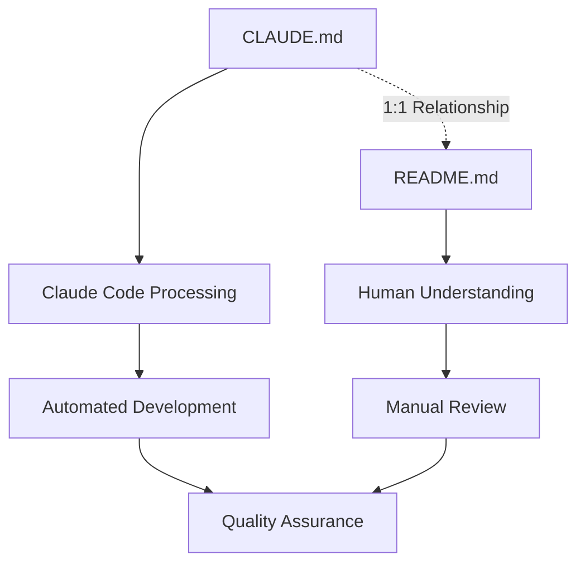
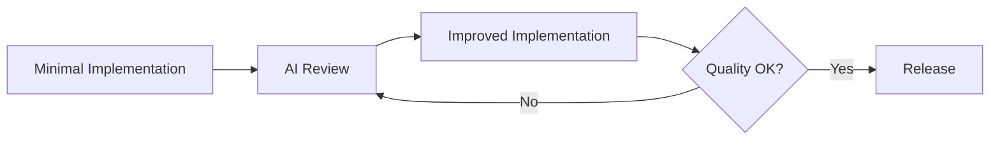

# CLAUDE.md

This file provides guidance to Claude Code (claude.ai/code) when working with code in this repository.

## Documentation Structure and Relationship

### CLAUDE.md - README.md Integration System

- **CLAUDE.md** (this file): Contains workflows and configurations for Claude Code to understand prompts and project structure
- **README.md**: Provides human-readable documentation that mirrors and explains the content in CLAUDE.md
- **1:1 Relationship**: CLAUDE.md and README.md maintain a one-to-one correspondence where each section in CLAUDE.md has an equivalent explanation in README.md. This constraint applies to the entire project structure - any CLAUDE.md file must have a corresponding README.md file in the same directory.

### Language Configuration

- **Default Language**: Japanese
- **README.md Language**: The README.md file uses the default language setting for all documentation
- **Translation Support**: Multi-language documentation can be provided through the i18n system

### Mermaid Visualization Workflow

The README.md file includes Mermaid diagrams to visualize:

- Project architecture overview
- Development workflow processes
- Component relationships
- System integration patterns



## Claude 4 Best Practices Implementation

This project follows the Claude 4 prompt engineering best practices defined in `docs/CLAUDE_4_BEST_PRACTICES.md`. The implementation focuses on the core principle:

**「小さなドラフト → 厳しい批評 → 再生成 → リリース」(Small draft → Critical review → Regenerate → Release)**

### Core Implementation Principles

1. **AI Review-First Design**: Use Claude as a "Senior Reviewer" rather than "Junior Designer"
2. **Structured Quality Assessment**: Security (HIGH) → SOLID Principles (MEDIUM) → Performance (LOW)
3. **Iterative Review Cycles**: 3-4 review iterations maximum with 400-character summaries
4. **Human Final Validation**: Always include human verification as the final step

For comprehensive details, refer to [Claude 4 Best Practices](docs/CLAUDE_4_BEST_PRACTICES.md).

### AI Review-First Implementation Workflow

Implement the core Claude 4 Best Practices workflow for all development tasks:

#### Step 1: Minimal Implementation Draft

Create basic functionality with essential features:

```text
Context: Flutter monorepo with Riverpod + go_router + slang
Task: [Specific feature name]
Requirements:
- Essential functionality only
- Follow existing project patterns
- Use established dependencies and conventions
Output: Minimal working implementation
```

#### Step 2: AI Review Cycles (3-4 iterations)

**Review Template for All Code**:

```text
Review Request: [Brief description]

Apply Claude 4 AI Review-First methodology:

1. Security Analysis (HIGH Priority):
   - Hardcoded secrets/credentials scan
   - Input validation and sanitization
   - Secure data storage practices
   - Network communication security

2. Architecture Review (MEDIUM Priority):
   - SOLID principles compliance
   - Design pattern consistency
   - Separation of concerns
   - Code organization and structure

3. Performance Review (LOW Priority):
   - Bottleneck identification
   - Algorithm efficiency
   - Resource utilization
   - Build/runtime optimization

Format: Max 400 characters per category
Output: Specific actionable recommendations
Priority: Mark each issue as HIGH/MEDIUM/LOW
```

#### Step 3: Quality Gate Validation

All implementations must pass these gates:

```bash
# Security Gates (HIGH Priority)
- No hardcoded secrets: grep -r --exclude-dir=.git -E "(API_KEY|SECRET|PASSWORD|TOKEN|PRIVATE_KEY)" .
- Input validation implemented
- Secure storage patterns used

# Architecture Gates (MEDIUM Priority)
mise run analyze          # Static analysis
mise run test            # All tests pass

# Performance Gates (LOW Priority)
- No obvious bottlenecks identified
- Efficient patterns used
```

#### Step 4: Final Validation Checklist

- [ ] HIGH priority security issues: ✅ Resolved
- [ ] MEDIUM priority architecture issues: ✅ Addressed
- [ ] LOW priority performance issues: ✅ Optimized
- [ ] Static analysis: ✅ `mise run analyze` passes
- [ ] All tests: ✅ `mise run test` passes
- [ ] Translation validation: ✅ `mise run analyze-slang` passes
- [ ] Code formatting: ✅ `mise run format` applied
- [ ] Human validation: ✅ Final review completed

### Context Requirements for AI Interactions

When working with this codebase, always provide:

1. **Project Context**: This is a Flutter monorepo using Melos for package management
2. **Architecture Context**: Riverpod for state management, go_router for navigation, slang for i18n
3. **Code Generation**: Uses build_runner, requires running `melos run gen` after model changes
4. **Testing Strategy**: Widget tests in `app/test/`, run via `melos run test`
5. **Quality Assurance**: Multi-stage pipeline with static analysis, formatting, and translation validation

### Effective Prompting Guidelines

#### For Feature Implementation (AI Review-First)

Use this Claude 4 optimized prompt structure:

```text
Phase 1 - Minimal Implementation:
Context: Flutter monorepo with Riverpod + go_router + slang architecture
Task: Implement [specific feature name]
Constraints:
- Essential functionality only (no extra features)
- Reference existing patterns: [provide specific file examples]
- Follow project conventions: [naming, structure, dependencies]
- Technology stack: Riverpod (@riverpod), go_router (type-safe), slang (ja/en)

Phase 2 - AI Review Request:
Apply Claude 4 Review-First methodology:
1. Security scan (HIGH): secrets, validation, storage
2. Architecture review (MEDIUM): SOLID principles, patterns
3. Performance check (LOW): bottlenecks, efficiency
Format: 400 chars max per category, actionable recommendations

Phase 3 - Quality Validation:
- Pass: mise run analyze (static analysis)
- Pass: mise run test (all tests)
- Pass: mise run analyze-slang (translations)
- Include: Widget tests in app/test/
- Include: Proper error handling patterns

Output: Complete implementation + test cases + required commands
```

#### For Code Review (Claude 4 Enhanced)

Use this AI Review-First optimized template:

```text
Code Review Request: [Brief description]

Implement Claude 4 "Senior Reviewer" approach:

🔴 Security Analysis (HIGH Priority - Fix Immediately):
   - Secrets/credentials scan: grep patterns, environment variables
   - Input validation: sanitization, type checking, bounds
   - Data security: encryption, secure storage, transmission
   - Authentication: proper token handling, session management

🟡 Architecture Review (MEDIUM Priority - Address Next):
   - SOLID principles: SRP, OCP, LSP, ISP, DIP compliance
   - Design patterns: consistency with project conventions
   - Code organization: separation of concerns, modularity
   - Error handling: proper exception patterns, user feedback

🟢 Performance Review (LOW Priority - Optimize Later):
   - Algorithmic efficiency: O(n) complexity analysis
   - Resource usage: memory, CPU, network optimization
   - Flutter-specific: widget rebuilds, state management efficiency
   - Build performance: dependency impact, code splitting

Constraints:
- Maximum 400 characters per category summary
- Provide specific file:line references
- Include actionable next steps
- Prioritize issues: 🔴 HIGH → 🟡 MEDIUM → 🟢 LOW

Expected: 3-4 review iterations maximum
```

#### For Documentation Updates

Use this documentation prompt:

```text
Documentation Task: Update [specific documentation]
Context: Maintain 1:1 correspondence between CLAUDE.md and README.md
Requirements:
- Technical accuracy for Claude Code
- Human readability for README.md
- Include relevant Mermaid diagrams
- Follow project's Japanese language standard for README.md
- Maintain existing section structure

Constraints:
- No breaking changes to existing workflow
- Preserve all environment variable definitions
- Keep all existing mise task references
```

### Tool Usage Optimization

#### Parallel Tool Calls

When performing multiple related operations, always use parallel tool calls:

```text
// Instead of sequential calls
Read file A, then Read file B, then Read file C

// Use parallel calls
Read files A, B, and C simultaneously for better performance
```

#### Specific Tool Usage Patterns

- **Search Operations**: Use Task tool for keyword searches across large codebases
- **File Operations**: Use Read for specific files, Glob for pattern matching
- **Code Analysis**: Combine Grep and Read tools for comprehensive analysis
- **Testing**: Always run `melos run test` after code changes

## Project Overview

This is a Flutter mobile application development project using Claude Code with automated development workflow integrated with GitHub Issue management system.

### Technology Stack

- **Framework**: Flutter (Workspace/Monorepo structure)
- **Version Management**: mise (polyglot tool version manager)
- **Task Management**: GitHub Issues
- **Parallel Development**: git worktree
- **Automation**: Claude Code with background tasks
- **State Management**: Riverpod (hooks_riverpod, riverpod_annotation)
- **Navigation**: go_router (declarative routing)
- **Internationalization**: slang (type-safe translations)
- **Build Tools**: build_runner, freezed
- **Monorepo Management**: Melos + pub workspace

## Project Structure

<!-- AUTO-GENERATED SECTION: This section is automatically updated when project structure changes -->

```bash
flutter_template_project/
├── .claude-workspaces/         # Claude Code working directories (replaces worktrees/)
├── app/                        # Main Flutter application
│   ├── lib/
│   │   ├── main.dart          # Entry point
│   │   ├── pages/             # UI pages
│   │   │   ├── home/          # Home page components
│   │   │   └── settings/      # Settings page components
│   │   ├── router/            # go_router config and type-safe route definitions
│   │   └── i18n/              # slang-generated multilingual files
│   ├── assets/i18n/           # JSON translation files (ja.i18n.json, en.i18n.json)
│   ├── test/                  # Widget tests
│   ├── android/               # Android platform specific files
│   ├── ios/                   # iOS platform specific files
│   ├── web/                   # Web platform specific files
│   ├── linux/                 # Linux platform specific files
│   ├── macos/                 # macOS platform specific files
│   └── windows/               # Windows platform specific files
├── packages/                  # Shared packages (currently empty)
├── .vscode/                   # VS Code IDE configuration
│   └── settings.json          # Editor settings for Flutter development
├── docs/                      # Project documentation
│   ├── CLAUDE_4_BEST_PRACTICES.md
│   ├── COMMITLINT_RULES.md
│   └── WORKTREE_ARCHITECTURE.md
├── scripts/                   # Build and utility scripts
├── pubspec.yaml               # Workspace configuration
├── package.json               # Node.js dependencies (commitlint, prettier)
└── LICENSE                    # MIT License file
```

<!-- END AUTO-GENERATED SECTION -->

## Environment Setup

### Requirements

- Flutter SDK (managed by mise)
- bun (managed by mise)
- Git worktree support
- GitHub CLI (gh) installed and authenticated
- Claude Code ENABLE_BACKGROUND_TASKS enabled
- Bun (for commitlint, prettier, faster than Node.js)

## Development Commands

### Mise Tasks (Recommended - Unified Interface)

```bash
# Complete development workflow
mise run dev

# Initial project setup
mise run setup

# Code quality workflow
mise run quality

# Complete CI workflow
mise run ci-check
```

### Individual Mise Tasks

```bash
# Code analysis and testing
mise run analyze          # Static analysis (calls melos run analyze)
mise run analyze-slang    # Translation validation (calls melos run analyze:slang)
mise run test             # Run tests (calls melos run test)

# Code formatting
mise run format       # Format all files (calls both above)

# Build and run
mise run run              # Run app (debug) (calls melos exec --scope=app -- flutter run)

# Maintenance
mise run clean-branch     # Clean git branches/worktrees (calls ./scripts/clean-branch.sh)
```

### Legacy Commands (Still Available)

#### Melos Commands

```bash
melos run gen             # Code generation
melos run get             # Install dependencies
melos run analyze         # Static analysis
melos run format          # Code formatting
melos run test            # Run tests
```

#### Bun Commands

```bash
bun run lint              # YAML/Markdown lint
bun run format            # YAML/Markdown format
bun run clean             # Clean and reinstall
```

### Environment Variables

```bash
export ENABLE_BACKGROUND_TASKS=true
export FLUTTER_VERSION_MANAGEMENT=mise
export TASK_MANAGEMENT_SYSTEM=github
export PARALLEL_DEVELOPMENT=git_worktree
export PR_LANGUAGE=japanese
export COMPLETION_NOTIFICATION=alarm
export INTERACTIVE_MODE=true
export ISSUE_SELECTION_UI=enabled
export AUTO_CONFIRM_WITH_ARGS=true      # Skip confirmation when arguments provided
export SILENT_MODE_WITH_ARGS=false      # Continue progress display
export ERROR_ONLY_OUTPUT=false          # Display non-error output
export CLAUDE_ISOLATION_MODE=true       # Work isolation during parallel execution
export CLAUDE_WORKSPACE_DIR=".claude-workspaces" # Project-internal working directory
export CLAUDE_MEMORY_ISOLATION=true     # Memory/context isolation
export GITHUB_ACTIONS_CHECK=true        # Enable GitHub Actions completion check
export CHECK_PR_WORKFLOW="check-pr.yml" # Target workflow file to monitor
```

## Architecture Design

### State Management: Riverpod

- **Providers**: Located in `app_preferences/lib/src/providers/`
- **Code Generation**: Use `@riverpod` annotation, generate with `melos run gen`
- **AsyncValue**: Used for asynchronous operation state management
- **Provider Types**:
  - `StateNotifierProvider`: Logic with state changes
  - `FutureProvider`: Asynchronous data retrieval
  - `StreamProvider`: Real-time data streams

### Navigation: go_router

- **Route Definition**: `app/lib/router/app_routes.dart`
- **Type-safe Routing**: Achieve type safety with `@TypedGoRoute` annotation
- **Navigation Example**: `HomePageRoute().go(context)`

### Internationalization: slang

- **Translation Files**: Place `ja.i18n.json` and `en.i18n.json` in `app/assets/i18n/`
- **Type-safe Access**: Access translation strings with `context.i18n.someKey`
- **Dynamic Switching**: Runtime language switching using LocaleSettings

### Theme Management

- **Theme Provider**: Managed by `app_preferences` package
- **Persistence**: Save selected theme using SharedPreferences
- **System Theme**: Material You (Android 12+) support

## Custom Slash Commands Configuration

### Available Commands

- `/task` - GitHub Issue processing command (see `.claude/commands/task.md` for detailed implementation)

### Command File Placement

```
.claude/
└── commands/
    └── task.md            # Complete GitHub Issue processing implementation
```

## Development Workflow

### Git Worktree Usage (Recommended)

This project uses **git worktree** for parallel development:

1. **Parallel Development**: Multiple Issues can be worked on simultaneously
2. **Branch Isolation**: Each Issue gets its own working directory via git worktree
3. **Environment Independence**: Separate Flutter environments per worktree
4. **Conflict Prevention**: Isolated workspaces prevent interference between tasks

**Basic git worktree commands**:

```bash
# Create new worktree
git worktree add path/to/worktree -b branch-name

# List active worktrees
git worktree list

# Remove completed worktree
git worktree remove path/to/worktree
```

**Note**: The `/task` command handles git worktree creation automatically for GitHub Issue processing.

For detailed GitHub Issue processing workflow, execution examples, and configuration options, refer to `.claude/commands/task.md`.

---

**Note**: This file is an important configuration file that controls Claude Code behavior. Test thoroughly when making changes.

## Development Guidelines

### Code Generation

- Always execute `melos run gen` after adding new model classes or providers
- Do not directly edit generated files (`*.g.dart`, `*.freezed.dart`)

### Testing

- Add corresponding widget tests to `app/test/` when adding new features
- Execute `melos run test` to run tests for all packages
- Include tests as targets for AI Review-First

### Git Workflow

- Use [Conventional Commits](https://www.conventionalcommits.org/) format for commit messages
- **Branch naming**: Use only `feature/ISSUE_ID` format (no Japanese/English descriptions)
- PR checks automatically execute with `.github/workflows/check-pr.yml`
- Includes analysis, formatting, testing, i18n validation

### Package Management

- Add new dependencies to the appropriate package's `pubspec.yaml`
- Same versions used across all packages due to Workspace resolution
- Update all package dependencies collectively with `melos run get`

## AI Review-First Automated Workflows

### Workflow 1: Claude 4 Quality Assurance Pipeline

**Purpose**: Implement complete AI Review-First development cycle with Claude as "Senior Reviewer"

**Core Cycle: Small draft → Critical review → Regenerate → Release**



**Implementation Steps**:

1. **Minimal Draft Creation**:

   ```bash
   # Create essential functionality only
   # Follow existing project patterns
   # Use established dependencies
   ```

2. **AI Security Review** (HIGH Priority - Fix Immediately):

   ```bash
   # Automated security scanning
   grep -r "API_KEY\|SECRET\|PASSWORD\|TOKEN" lib/
   # Manual security pattern review
   # Input validation verification
   # Secure storage pattern check
   ```

3. **AI Architecture Review** (MEDIUM Priority - Address Next):

   ```bash
   mise run analyze    # Static analysis compliance
   # SOLID principles evaluation
   # Design pattern consistency review
   # Code organization assessment
   ```

4. **AI Performance Review** (LOW Priority - Optimize Later):

   ```bash
   mise run test      # Performance regression testing
   # Algorithmic efficiency analysis
   # Resource utilization review
   # Build impact assessment
   ```

5. **Quality Gate Validation**:
   ```bash
   mise run ci-check           # Complete CI validation
   mise run analyze-slang      # Translation validation
   mise run format         # Code formatting
   # Human final validation
   ```

### Workflow 2: Documentation Synchronization with AI Review

**Purpose**: Maintain CLAUDE.md and README.md consistency using AI Review-First principles

**AI-Enhanced Steps**:

1. **Content Monitoring**: Detect project structure changes automatically
2. **AI Documentation Review**:
   - Evaluate clarity and specificity of instructions
   - Validate Claude 4 Best Practices compliance
   - Check 1:1 relationship enforcement between CLAUDE.md and README.md
3. **Iterative Improvement**:
   - Apply AI feedback to documentation structure
   - Enhance context provision and constraint definitions
   - Validate technical accuracy
4. **Quality Gates**:
   ```bash
   melos run format:prettier # Markdown formatting
   # Manual review of AI-suggested improvements
   ```

### Workflow 3: Development Environment Validation with AI Assistance

**Purpose**: Ensure robust development environment using AI-assisted validation

**AI-Assisted Validation Steps**:

1. **Environment Analysis**:
   ```bash
   mise list                    # Version validation
   gh auth status              # GitHub CLI verification
   git worktree list          # Worktree support check
   ```
2. **AI Configuration Review**:
   - Validate environment variable completeness
   - Check Claude Code integration settings
   - Verify GitHub Actions workflow compatibility
3. **Automated Validation**:
   ```bash
   mise run setup             # Environment setup
   melos bootstrap           # Dependencies installation
   melos run gen             # Code generation test
   ```
4. **Quality Assurance**:
   ```bash
   melos run ci-check        # Complete CI pipeline validation
   ```

### Claude 4 AI Review-First Quality Standards

All development must meet these Claude 4 Best Practices criteria:

#### 🔴 Security Standards (HIGH Priority - Critical)

**Required for all implementations**:

- ✅ No hardcoded secrets/credentials in source code
- ✅ Input validation and sanitization implemented
- ✅ Secure data storage patterns (SharedPreferences, Keychain)
- ✅ Encrypted network communication (HTTPS/TLS)
- ✅ Proper authentication token handling
- ✅ Error handling without information disclosure

**Validation Commands**:

```bash
grep -r "API_KEY\|SECRET\|PASSWORD\|TOKEN" lib/  # Must return empty
mise run analyze                                # Must pass
```

#### 🟡 Architecture Standards (MEDIUM Priority - Important)

**SOLID Principles Compliance**:

- ✅ Single Responsibility: Each class has one reason to change
- ✅ Open/Closed: Open for extension, closed for modification
- ✅ Liskov Substitution: Subtypes must be substitutable
- ✅ Interface Segregation: No unused interface dependencies
- ✅ Dependency Inversion: Depend on abstractions, not concretions

**Project Consistency**:

- ✅ Riverpod provider patterns (@riverpod annotation)
- ✅ go_router type-safe navigation
- ✅ slang internationalization structure
- ✅ Proper error handling and user feedback

#### 🟢 Performance Standards (LOW Priority - Enhancement)

**Efficiency Requirements**:

- ✅ No O(n²) algorithms where O(n) is possible
- ✅ Widget rebuild optimization (const constructors, keys)
- ✅ Lazy loading for large datasets
- ✅ Image optimization and caching
- ✅ Build time impact minimization

#### Review Cycle Standards

**Claude 4 Iteration Requirements**:

- **Maximum iterations**: 3-4 review cycles per implementation
- **Summary constraint**: 400 characters maximum per category
- **Issue resolution order**: 🔴 HIGH → 🟡 MEDIUM → 🟢 LOW
- **Final validation**: Human review required for production release
- **Quality gate**: All `mise run ci-check` tests must pass

**Review Output Format**:

```text
🔴 Security: [400 char summary]
🟡 Architecture: [400 char summary]
🟢 Performance: [400 char summary]
Next Action: [Specific next steps]
```
