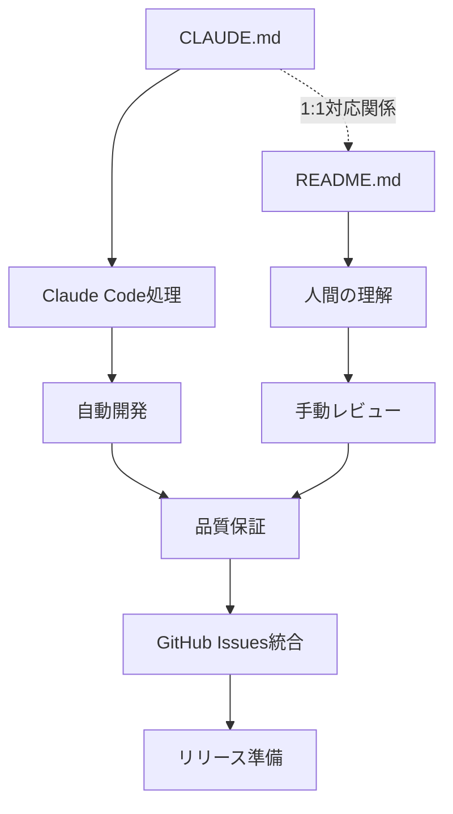
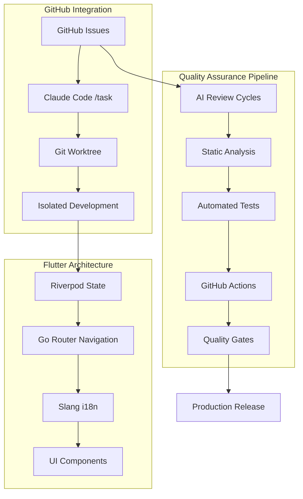
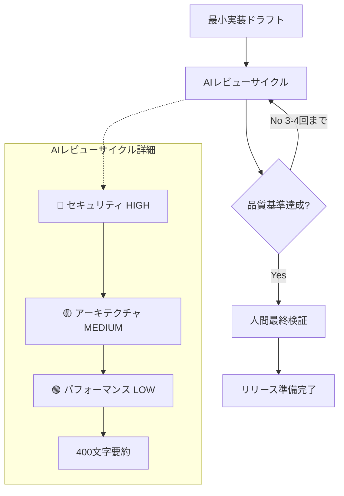
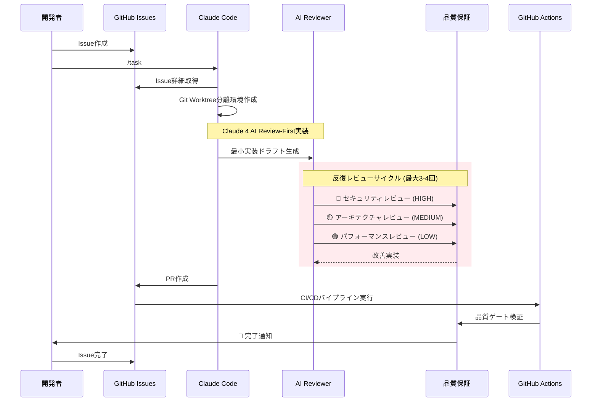
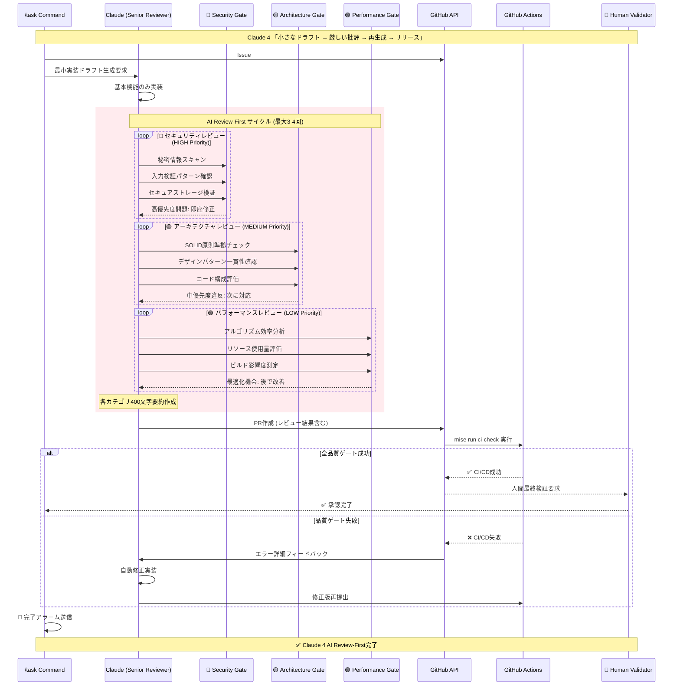

# Flutter Template Project

**CLAUDE.md と README.md の1:1対応による GitHub Issues 統合 AI支援開発プラットフォーム**

## ドキュメント構造と関係性

このプロジェクトは、AIと人間の両方に対応した包括的なドキュメント体系を採用しています：

### CLAUDE.md - README.md 統合システム



### ドキュメント構成

| ファイル      | 目的                               | 読者       | 関係性 |
| ------------- | ---------------------------------- | ---------- | ------ |
| **CLAUDE.md** | Claude Code用ワークフロー設定      | AIシステム | ←→     |
| **README.md** | 人間向けプロジェクト説明（本文書） | 開発チーム | ←→     |

**1:1対応の原則**: CLAUDE.mdの各セクションは、README.mdで対応する人間向け説明を持ちます。

### 言語設定

- **デフォルト言語**: Japanese（日本語）
- **README.md言語**: デフォルト言語設定に従い日本語で記述
- **多言語対応**: slang i18nシステムによる拡張可能

## プロジェクト概要

AI支援開発とモダンアーキテクチャを組み合わせた、GitHub Issues統合エンタープライズ対応Flutterアプリケーションテンプレートです。

### 核となる特徴

- **🤖 AI支援開発**: Claude CodeとGitHub Issuesの統合による自動開発
- **📋 GitHub Issues統合**: ネイティブGitHub Issue管理による効率的なタスク処理
- **📦 モノレポ構造**: Melosによる効率的なパッケージ管理
- **🎯 型安全性**: Riverpod、go_router、slangによる堅牢なアーキテクチャ
- **⚡ 開発効率**: 自動コード生成と高速開発サイクル
- **🔍 高度な品質保証**: AI Review-First方式による多段階品質管理

## セットアップ

| ツール  | 推奨バージョン | インストール方法                            |
| ------- | -------------- | ------------------------------------------- |
| Flutter | mise管理       | `mise install`                              |
| Bun     | 1.2+           | `curl -fsSL https://bun.sh/install \| bash` |
| Melos   | 7.0+           | `dart pub global activate melos`            |

### クイックスタート

```bash
# 1. プロジェクトを取得
git clone <repository-url>
cd flutter_template_project

# 2. 開発環境を構築

mise install
eval "$(mise activate bash)"
npm install

melos bootstrap

# 3. GitHub CLI認証（必須）
gh auth login

# 4. 環境変数設定
export ENABLE_BACKGROUND_TASKS=true
export TASK_MANAGEMENT_SYSTEM=github
export GITHUB_ACTIONS_CHECK=true

# 5. コード生成を実行
melos run gen
```

## アーキテクチャ概要

### システム構成図



### 技術スタック

| 分野               | 技術                             | 役割                             |
| ------------------ | -------------------------------- | -------------------------------- |
| **フレームワーク** | Flutter + mise                   | マルチプラットフォーム開発       |
| **状態管理**       | Riverpod + Hooks                 | リアクティブな状態アーキテクチャ |
| **ナビゲーション** | go_router                        | 型安全なルーティング             |
| **国際化**         | slang                            | コード生成による多言語対応       |
| **モノレポ**       | Melos                            | パッケージ統合管理               |
| **AI開発**         | Claude Code + GitHub Issues      | 自動化された開発ワークフロー     |
| **品質管理**       | AI Review-First + GitHub Actions | 多段階品質保証システム           |

## Claude 4 AI Review-First開発ワークフロー

### 核心原則: 「小さなドラフト → 厳しい批評 → 再生成 → リリース」



### GitHub Issues統合AI開発プロセス



### /task コマンド: Claude 4 AI Review-First統合

```bash
# インタラクティブモード（推奨）
/task
? Select Issues to process: #123, #456

# 直接実行モード
/task #123 #456

# Claude 4 AI Review-First実行プロセス:
# 🔄 Phase 1: GitHub Issue詳細取得
# 🔄 Phase 2: Git Worktree分離環境作成
# 🔄 Phase 3: 最小実装ドラフト生成
# 🔄 Phase 4: AIレビューサイクル (3-4回)
#     ├── 🔴 セキュリティスキャン (HIGH優先度)
#     ├── 🟡 アーキテクチャ検証 (MEDIUM優先度)
#     └── 🟢 パフォーマンス分析 (LOW優先度)
# 🔄 Phase 5: 品質ゲート検証
# 🔄 Phase 6: GitHub Actions CI/CD統合
# ✅ Phase 7: 完了通知 + 人間最終検証
```

### Claude 4レビュー品質基準

| 優先度    | カテゴリ       | 評価項目                                     | 修正タイミング |
| --------- | -------------- | -------------------------------------------- | -------------- |
| 🔴 HIGH   | セキュリティ   | ハードコード秘密情報、入力検証、暗号化       | 即座に修正     |
| 🟡 MEDIUM | アーキテクチャ | SOLID原則、デザインパターン、コード構成      | 次に対応       |
| 🟢 LOW    | パフォーマンス | アルゴリズム効率、リソース使用、ビルド最適化 | 後で最適化     |

## Claude 4 AI Review-First品質管理システム

### 品質保証パイプライン: 「シニアレビュアー」としてのClaude活用



### Claude 4品質基準: 優先度別評価システム

#### 🔴 セキュリティ基準 (HIGH Priority - 即座修正)

**クリティカル要件**:

- ✅ ハードコードされた秘密情報の完全排除
  ```bash
  grep -r "API_KEY\|SECRET\|PASSWORD\|TOKEN" lib/  # 空であること
  ```
- ✅ 入力値検証・サニタイゼーション実装
- ✅ セキュアなデータストレージ (SharedPreferences暗号化)
- ✅ HTTPS/TLS通信の強制
- ✅ 認証トークンの適切な処理
- ✅ エラー情報漏洩防止

#### 🟡 アーキテクチャ基準 (MEDIUM Priority - 次に対応)

**SOLID原則準拠**:

- ✅ **Single Responsibility**: 各クラス単一責任
- ✅ **Open/Closed**: 拡張開放・修正閉鎖
- ✅ **Liskov Substitution**: サブタイプ置換可能性
- ✅ **Interface Segregation**: インターフェース分離
- ✅ **Dependency Inversion**: 依存関係逆転

**プロジェクト一貫性**:

- ✅ Riverpod providers (@riverpod annotation)
- ✅ go_router型安全ナビゲーション
- ✅ slang多言語対応構造
- ✅ 適切なエラーハンドリング

#### 🟢 パフォーマンス基準 (LOW Priority - 後で最適化)

**効率性要件**:

- ✅ O(n²)アルゴリズムをO(n)に最適化
- ✅ Widgetリビルド最適化 (const, keys使用)
- ✅ 大規模データセットの遅延読み込み
- ✅ 画像最適化・キャッシュ実装
- ✅ ビルド時間影響最小化

### Claude 4レビューサイクル標準

**反復要件**:

- **最大反復回数**: 3-4サイクル
- **要約制約**: カテゴリ毎400文字以内
- **問題解決順序**: 🔴 HIGH → 🟡 MEDIUM → 🟢 LOW
- **最終検証**: 人間レビュー必須
- **品質ゲート**: `mise run ci-check` 全テスト成功

**レビュー出力形式**:

```text
🔴 セキュリティ: [400文字要約 + 具体的修正指示]
🟡 アーキテクチャ: [400文字要約 + 改善提案]
🟢 パフォーマンス: [400文字要約 + 最適化案]
次のアクション: [優先順位付き具体的手順]
```

## 開発コマンド

### Miseタスク（推奨統一インターフェース）

```bash
# 完全開発ワークフロー
mise run dev

# 初期プロジェクトセットアップ
mise run setup

# コード品質ワークフロー
mise run quality

# 完全CIワークフロー
mise run ci-check
```

### 個別Miseタスク

```bash
# コード解析とテスト
mise run analyze          # 静的解析 (melos run analyze呼出)
mise run analyze-slang    # 翻訳検証 (melos run analyze:slang呼出)
mise run test             # テスト実行 (melos run test呼出)

# コード整形
mise run format       # 全ファイル整形 (両方の整形実行)

# ビルドと実行
mise run run              # アプリ実行（デバッグ） (melos exec --scope=app -- flutter run呼出)

# メンテナンス
mise run clean-branch     # Gitブランチ/ワークツリークリーン (./scripts/clean-branch.sh呼出)
```

### レガシーコマンド（引き続き利用可能）

#### Melosコマンド

```bash
melos run gen             # コード生成
melos run get             # 依存関係取得
melos run analyze         # 静的解析
melos run format          # コード整形
melos run test            # テスト実行
```

#### Bunコマンド

```bash
bun run lint              # YAML/Markdownリント
bun run format            # YAML/Markdown整形
bun run clean             # クリーンと再インストール
```

## プロジェクト構成

```bash
flutter_template_project/
├── 📱 app/                      # メインアプリケーション
│   ├── lib/                     # アプリケーションコード
│   │   ├── main.dart           # エントリーポイント
│   │   ├── pages/              # UIページ
│   │   ├── router/             # go_router設定
│   │   └── i18n/               # 多言語対応ファイル
│   ├── assets/i18n/            # 翻訳JSONファイル
│   └── test/                   # ウィジェットテスト
├── 📦 packages/                 # 共有パッケージ
├── 🤖 .claude-workspaces/       # AI開発用分離環境
├── ⚙️ .vscode/                  # VS Code IDE設定
│   └── settings.json           # Flutter開発用エディタ設定
├── 📋 CLAUDE.md                 # AI用プロジェクト設定
├── 📋 README.md                 # 人間用プロジェクト説明（本文書）
├── 🔧 scripts/                 # 自動化スクリプト
├── 🔧 .claude/                 # Claude Code設定
│   └── commands/
│       └── task.md             # GitHub Issue処理コマンド
├── 📚 docs/                    # 専用ドキュメント
│   ├── CLAUDE_4_BEST_PRACTICES.md # AI設計原則
│   ├── COMMITLINT_RULES.md     # コミット規約
│   └── WORKTREE_ARCHITECTURE.md # 並列開発アーキテクチャ
├── 📄 LICENSE                   # MITライセンス
└── 📋 pubspec.yaml              # ワークスペース設定
```

## 自動化されたワークフロー

### Workflow 1: コード品質保証

**目的**: 全開発活動において一貫したコード品質を保証

**実行内容**:

1. `melos run analyze` - 静的解析
2. `melos run ci:format` - フォーマット検証
3. `melos run test` - 自動テスト
4. `melos run analyze:slang` - 翻訳検証

### Workflow 2: ドキュメント同期

**目的**: CLAUDE.mdと関連ドキュメントの整合性維持

**実行内容**:

1. プロジェクト構造変更の監視
2. 自動更新による構造セクションの維持
3. Claude 4 Best Practices準拠の検証

### Workflow 3: 開発環境検証

**目的**: 適切な開発環境のセットアップと設定の保証

**実行内容**:

1. `mise` Flutter バージョン検証
2. GitHub CLI 設定確認
3. `git worktree` サポート検証
4. 環境変数の妥当性確認

## ドキュメント体系

### 包括的ドキュメント構成

| ドキュメント                                                       | 内容             | 対象者      | CLAUDE.md対応セクション |
| ------------------------------------------------------------------ | ---------------- | ----------- | ----------------------- |
| [README.md](README.md)                                             | プロジェクト概要 | 開発者      | 全体構成                |
| [CLAUDE.md](CLAUDE.md)                                             | AI開発設定       | Claude Code | 全体構成                |
| [docs/CLAUDE_4_BEST_PRACTICES.md](docs/CLAUDE_4_BEST_PRACTICES.md) | AI設計原則       | AI開発者    | AI Review-First         |
| [docs/COMMITLINT_RULES.md](docs/COMMITLINT_RULES.md)               | コミット規約     | 開発者      | Git Workflow            |
| [docs/PROJECT_OVERVIEW.md](docs/PROJECT_OVERVIEW.md)               | プロジェクト概要 | 開発者      | プロジェクト概要        |
| [docs/WORKTREE_ARCHITECTURE.md](docs/WORKTREE_ARCHITECTURE.md)     | 並列開発         | AI開発者    | Git Worktree            |
| [.claude/commands/task.md](.claude/commands/task.md)               | Issue処理        | Claude Code | カスタムコマンド        |

### Mermaid可視化の活用

このREADMEでは、以下の要素をMermaid記法で図式化しています：

1. **ドキュメント関係図**: CLAUDE.mdとREADME.mdの1:1対応関係
2. **システム構成図**: GitHub Issues統合アーキテクチャ全体の俯瞰
3. **AI開発フロー図**: GitHub Issues統合AI支援開発プロセスの可視化
4. **品質管理シーケンス図**: AI Review-First品質保証プロセスの詳細化

## 環境変数設定

### 必須設定

```bash
# Claude Code基本設定
export ENABLE_BACKGROUND_TASKS=true
export FLUTTER_VERSION_MANAGEMENT=mise
export TASK_MANAGEMENT_SYSTEM=github

# GitHub統合設定
export GITHUB_ACTIONS_CHECK=true
export CHECK_PR_WORKFLOW="check-pr.yml"

# 並列開発設定
export PARALLEL_DEVELOPMENT=git_worktree
export CLAUDE_ISOLATION_MODE=true
export CLAUDE_WORKSPACE_DIR=".claude-workspaces"

# UI・通知設定
export PR_LANGUAGE=japanese
export COMPLETION_NOTIFICATION=alarm
export INTERACTIVE_MODE=true
export ISSUE_SELECTION_UI=enabled
```

## 貢献方法

1. このリポジトリをフォーク
2. フィーチャーブランチを作成 (`git checkout -b feature/ISSUE-123`)
3. 変更をコミット (`git commit -m 'feat: add new feature [ISSUE-123]'`)
4. ブランチをプッシュ (`git push origin feature/ISSUE-123`)
5. プルリクエストを作成

### ブランチ命名規則

- **形式**: `feature/ISSUE-123` (Issue番号のみ)
- **禁止**: 日本語・英語での説明文追加は不可
- **理由**: 自動化されたワークフローとの整合性

## ライセンス

このプロジェクトは MIT ライセンスの下で公開されています。詳細は [LICENSE](LICENSE) を参照してください。

## サポート・コミュニティ

- 📖 [ドキュメント](docs/)
- 🐛 [Issue報告](https://github.com/your-org/flutter_template_project/issues)
- 💬 [ディスカッション](https://github.com/your-org/flutter_template_project/discussions)
- 🤖 [Claude Code統合ガイド](.claude/commands/task.md)

---

**CLAUDE.md と README.md の1:1対応により、AIと人間の両方に最適化されたGitHub Issues統合開発環境を提供します。**
