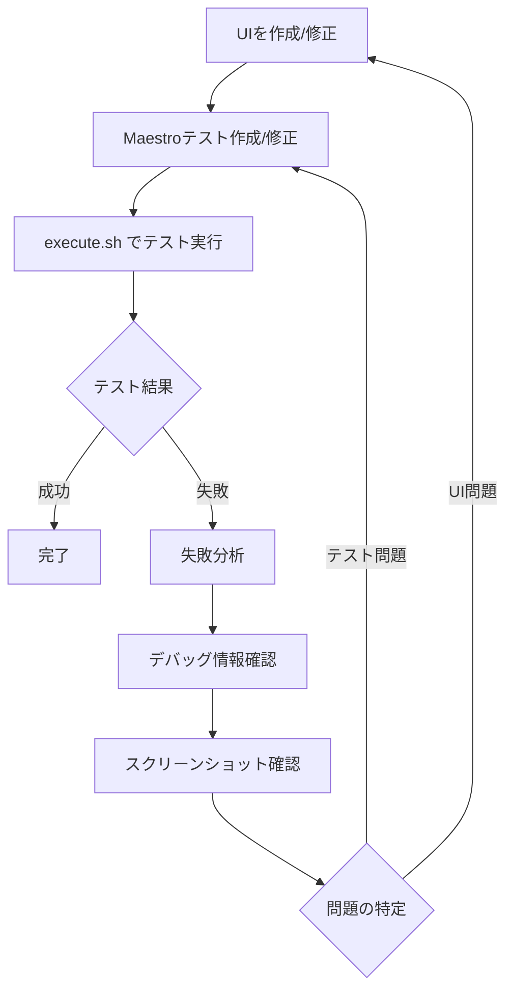

# Maestro UIテストフレームワーク

このディレクトリには、Claude CodeとMaestroを使用したFlutterアプリのUIテスト環境が含まれています。

## 概要

Maestroは、モバイルアプリのUI自動化テストを行うためのフレームワークです。このプロジェクトでは、Claude Codeと組み合わせて反復的なUI開発とテストのワークフローを実現しています。

## ディレクトリ構成

```
maestro/
├── README.md                    # プロジェクトドキュメント（日本語）
├── CLAUDE.md                    # Claude Code用の設定とワークフロー
├── execute.sh                   # メインテスト実行スクリプト
├── scripts/
│   └── counter_test.sh         # テンプレートスクリプト（非推奨）
├── test-output/                # テスト結果とアーティファクト
│   └── YYYYMMDD-HHMMSS/        # タイムスタンプ付きテスト結果
└── *.yaml                      # Maestroテストファイル
```

## 主要ファイル

### `execute.sh`

メインのテスト実行スクリプト。反復的なUI開発ワークフロー用に最適化されています。

**特徴:**

- **失敗前提の設計**: テスト失敗時も継続実行（デフォルト）
- **詳細なデバッグ情報**: 失敗時の原因分析と修正提案
- **環境変数連携**: `.dart_define/`の設定を自動読み込み
- **ウォッチモード**: ファイル変更を監視して自動再実行
- **アーティファクト保存**: テスト結果とスクリーンショットの自動保存

### テストファイル（YAML）

Maestro形式のUIテストファイル。環境変数を使用してflavorに応じたテストが可能です。

## 基本的な使用方法

### 1. 環境セットアップ

```bash
# 必要なツールのインストール
# Maestro
curl -Ls https://get.maestro.mobile.dev | bash

# jq（JSON解析用）
brew install jq  # macOS
# または
apt-get install jq  # Linux
```

### 2. テストの実行

```bash
# 基本的な実行（失敗しても継続）
./execute.sh counter_test.yaml

# 詳細デバッグモード
./execute.sh --verbose --debug counter_test.yaml

# ウォッチモード（ファイル変更で自動再実行）
./execute.sh --watch counter_test.yaml

# 特定のflavorでテスト
./execute.sh --flavor production counter_test.yaml

# 厳密モード（失敗時に終了）
./execute.sh --no-continue counter_test.yaml
```

### 3. 事前検証

```bash
# YAML構文と環境設定の検証のみ
./execute.sh --validate-only counter_test.yaml

# 実行内容の確認（実際のテストは実行しない）
./execute.sh --dry-run counter_test.yaml
```

## 開発ワークフロー

### 反復的UI開発のプロセス



### Claude Codeとの連携

1. **問題の特定**: テスト失敗時、Claude Codeが出力ログとスクリーンショットを分析
2. **修正提案**: UIの問題点やテストの改善点をClaude Codeが提案
3. **コード修正**: Claude CodeがFlutterのUIコードやMaestro YAMLを修正
4. **再テスト**: 修正後、自動的にテストを再実行

## テストファイルの作成

### 基本構造

```yaml
# アプリIDの設定（動的環境変数使用）
appId: ${FULL_APP_ID}
---
# アプリの起動
- launchApp

# UI要素のテスト
- assertVisible: '期待する要素'
- tapOn: 'ボタン'
- inputText: '入力テキスト'
```

### 環境変数の動的生成

システムは`.dart_define/{flavor}.json`ファイルから環境変数を自動読み込みし、パターンに基づいて組み合わせ変数を動的生成します。

#### 基本的な環境変数

```json
{
  "FLAVOR": "development",
  "APP_ID": "com.example.app",
  "APP_ID_SUFFIX": ".development",
  "APP_NAME": "Template Development"
}
```

#### 自動生成される組み合わせ変数

システムが自動的に以下のパターンを検出して組み合わせ変数を生成：

**パターン1: `*_ID` + `*_ID_SUFFIX` → `FULL_*_ID`**

- `APP_ID` + `APP_ID_SUFFIX` → `FULL_APP_ID`
- `DATABASE_ID` + `DATABASE_ID_SUFFIX` → `FULL_DATABASE_ID`
- `API_ID` + `API_ID_SUFFIX` → `FULL_API_ID`

**パターン2: `*_PREFIX` + `*_SUFFIX` → `FULL_*`**

- `URL_PREFIX` + `URL_SUFFIX` → `FULL_URL`
- `PATH_PREFIX` + `PATH_SUFFIX` → `FULL_PATH`

#### 利用可能な環境変数例

```bash
# 直接読み込まれる変数
FLAVOR=development
APP_ID=com.example.app
APP_ID_SUFFIX=.development
APP_NAME=Template Development

# 自動生成される変数
FULL_APP_ID=com.example.app.development  # APP_ID + APP_ID_SUFFIX
```

### 実際のテスト例（counter_test.yaml）

```yaml
# 動的環境変数を使用したシンプルなテスト構造
appId: ${FULL_APP_ID}
---
- launchApp
- assertVisible: 'Flutter Demo Home Page'
- assertVisible: 'カウンター: 0'
- tapOn:
    text: 'Increment'
- assertVisible: 'カウンター: 1'
- tapOn:
    text: 'Increment'
- assertVisible: 'カウンター: 2'
```

### 国際化対応

```yaml
# 日本語UI要素のテスト
- assertVisible: 'カウンター: 0'
- tapOn:
    text: 'Increment'

# 英語UI要素のテスト（多言語対応）
- assertVisible: 'Counter: 0'
- tapOn:
    text: 'Increment'
```

## トラブルシューティング

### よくある問題と解決方法

1. **アプリが起動しない**
   - デバイス/シミュレータでアプリがインストールされているか確認
   - `FULL_APP_ID`が正しいか確認
   - `.dart_define/{flavor}.json`の設定確認

2. **UI要素が見つからない**
   - スクリーンショット（`test-output/`内）でUI状態を確認
   - 要素のIDやテキストが正確か確認
   - アニメーション完了の待機（`waitForAnimationToEnd`）

3. **テストがタイムアウトする**
   - ネットワーク接続や読み込み時間の確認
   - 明示的な待機時間の追加
   - デバイスの性能確認

### デバッグオプション

```bash
# 詳細ログ出力
./execute.sh --verbose counter_test.yaml

# デバッグモード（Maestroの詳細出力）
./execute.sh --debug counter_test.yaml

# 失敗時に即座に終了（厳密モード）
./execute.sh --no-continue counter_test.yaml
```

## ベストプラクティス

### テスト設計

1. **小さなテストケース**: 一つのテストで一つの機能をテスト
2. **環境変数の活用**: ハードコードされた値を避ける
3. **適切な待機**: アニメーションや読み込みの完了を待つ
4. **意味のある名前**: テストファイルとケースに分かりやすい名前を付ける

### 開発プロセス

1. **段階的開発**: 基本機能から順次テストケースを追加
2. **継続的テスト**: コード変更時は必ずテストを実行
3. **失敗の活用**: テスト失敗を恐れず、改善の機会として活用
4. **ドキュメント化**: テストの意図と期待結果を明確に記載

## 参考リンク

- [Maestro公式ドキュメント](https://maestro.mobile.dev/)
- [Flutter UIテストガイド](https://docs.flutter.dev/testing)
- [Claude Code公式ドキュメント](https://docs.anthropic.com/en/docs/claude-code)

## サポート

問題や質問がある場合:

1. `test-output/`ディレクトリの最新のログとスクリーンショットを確認
2. `./execute.sh --help`でオプションの詳細を確認
3. GitHub Issues（存在する場合）で報告
4. Claude Codeに相談して解決策を依頼
