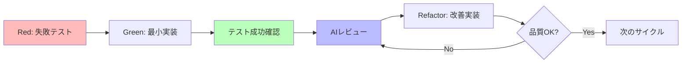

# Claude 4 プロンプトエンジニアリング ベストプラクティス

## 目的

Claude 4でTDD + AIレビューファーストによる高品質コード開発を実現する

## 要点

1. **TDD + AIレビューファースト**：Red-Green-Refactor + AI批評サイクル
2. **明確で具体的な指示**：曖昧さを排除し、期待する出力を詳細に指定
3. **構造化されたレビュー**：セキュリティ → SOLID → パフォーマンスの優先度

## 具体例：開発サイクルの実践

### ステップ1：Red（失敗テスト作成）

```typescript
// 30%テスト：最小限の期待値定義
describe('UserAuth', () => {
  it('正しい認証情報でログイン成功', () => {
    const auth = new UserAuth()
    const result = auth.login('user@example.com', 'password123')
    expect(result.success).toBe(true)
  })
})
```

### ステップ2：Green（最小実装）

Claude 4への指示：

```
JWTベースのユーザー認証機能を実装してください。
テストを通す最小限の実装のみ: login()メソッド
実装戦略: Fake It → 段階的一般化
```

### ステップ3：Refactor + AIレビュー

```
テスト成功後、以下観点でコードをレビュー：

🔴 セキュリティ（高優先度）：
- パスワードハッシュ化
- トークン有効期限検証

🟡 SOLID原則（中優先度）：
- 単一責任原則の遵守
- 依存性逆転の実装

🟢 パフォーマンス（低優先度）：
- トークン生成効率

400文字以内で要約してください。
```

---

## このガイドについて

このガイドは、Claude 4モデル（Opus 4およびSonnet 4）に特化した**TDD + AIレビューファースト設計**の実践方法を提供します。従来の「実装してからテスト」から「テスト駆動 + AI批評」への転換により、高品質なソフトウェアを効率的に開発できます。

## 参照文献

- [Claude 4 Best Practices (Anthropic公式)](https://docs.anthropic.com/en/docs/build-with-claude/prompt-engineering/claude-4-best-practices)
- [AIレビューファースト設計 (Zenn)](https://zenn.dev/caphtech/articles/ai-review-first-design)
- [TEST_DRIVEN_DEVELOPMENT](TEST_DRIVEN_DEVELOPMENT.md)

## 1. 核心原則

### TDD + AIレビューファーストサイクル



**「失敗テスト → 最小実装 → AI批評 → 改善 → リリース」**

### Claude 4への効果的な指示方法

#### ❌ 効果が低い例

```
良いコードを書いて
```

#### ✅ 効果的な例

```
Riverpodを使用してユーザー設定画面を作成してください。
要件：
- ThemeMode切り替え（light/dark/system）
- SharedPreferencesで永続化
- Material Design 3準拠
- slangによる多言語対応

制約：
- F.I.R.S.T.原則に従ったテスト付き
- SOLID原則を遵守
```

## 2. 実装戦略

### Flutterプロジェクトでの実践手順

1. **Red**: 30%テストから開始（5分以内）
2. **Green**: Claude 4に最小実装を依頼（10分以内）
3. **AIレビュー**: 構造化レビューテンプレート使用（5分以内）
4. **Refactor**: 優先度順に問題修正（10分以内）
5. **品質確認**: `melos run test && melos run analyze`

### 構造化レビューテンプレート

```yaml
review_request:
  code: '[レビュー対象コード]'

  evaluation_criteria:
    security:
      priority: 'HIGH'
      items:
        - 'ハードコーディングされた秘密情報'
        - '入力値検証の実装'
        - 'セキュアな保存方法'

    architecture:
      priority: 'MEDIUM'
      items:
        - 'SOLID原則の遵守'
        - '責任の分離'
        - '拡張性の考慮'

    performance:
      priority: 'LOW'
      items:
        - 'アルゴリズム効率'
        - 'リソース使用量'

  output_format: '400文字以内で各カテゴリごとに要約'
```

## 3. 高度なテクニック

### 並列ツール使用の最適化

```
複数ファイルの調査時：
- 関連ファイルを同時読み込み
- 独立検索を並列実行
- 待機時間の最小化
```

### コンテキスト付き指示

❌ 避ける：

```
省略記号を使わないで
```

✅ 推奨：

```
音声読み上げ対応のため省略記号（...）を避け、
「など」「その他」等の明確な表現を使用してください。
```

### XML形式の出力制御

```xml
<implementation>
  <summary>実装概要</summary>
  <code>具体的なコード</code>
  <tests>対応するテスト</tests>
  <security_notes>セキュリティ考慮事項</security_notes>
</implementation>
```

## 4. よくある落とし穴と回避方法

### 曖昧な指示の回避

| 避けるべき指示         | 改善された指示                                                                                            |
| ---------------------- | --------------------------------------------------------------------------------------------------------- |
| 「関数を作成して」     | 「JWT認証用の関数を作成。セキュリティベストプラクティスに従い、適切なエラーハンドリングを含めてください」 |
| 「テストを書かないで」 | 「実装済みのコードに対してウィジェットテストを作成してください」                                          |

### テスト偏重の回避

```
要件：汎用的なソリューション開発
- 全ての有効入力に対応
- ハードコーディング回避
- エッジケース考慮
- 拡張性重視

避けるべき：
- 特定テストケースのみ対応
- マジックナンバー使用
```

## 5. 品質基準とチェックリスト

### TDD品質基準

```yaml
tdd_quality_check:
  red_phase:
    - [ ] テスト失敗確認（Red実行結果）
    - [ ] 単一責任に集中
    - [ ] 実装なしで意図理解可能

  green_phase:
    - [ ] テスト成功確認（Green実行結果）
    - [ ] 最小変更での実装
    - [ ] 適切な実装戦略選択

  refactor_phase:
    - [ ] 継続的テスト成功
    - [ ] AIレビュー問題修正
    - [ ] 重複コード除去
```

### 品質ゲート

```bash
# 必須チェック
melos run test     # 全テスト成功
melos run analyze  # 静的解析パス

# 推奨チェック
melos run analyze-slang  # 翻訳検証
mise run format      # コード整形
```

## まとめ

**今日から実行できる3ステップ：**

1. **30%テスト作成**（5分）：単一の振る舞いテスト
2. **Claude 4実装依頼**（10分）：構造化された明確な指示
3. **AIレビュー実施**（5分）：🔴→🟡→🟢の優先順位

**核心価値：** 「テスト駆動 + AI批評」により、恐怖なく変更できる信頼性の高いコードを効率的に開発する。

最初は30%の完成度で十分です。失敗テストから始まるのがTDD + AIレビューファーストの第一歩です。
