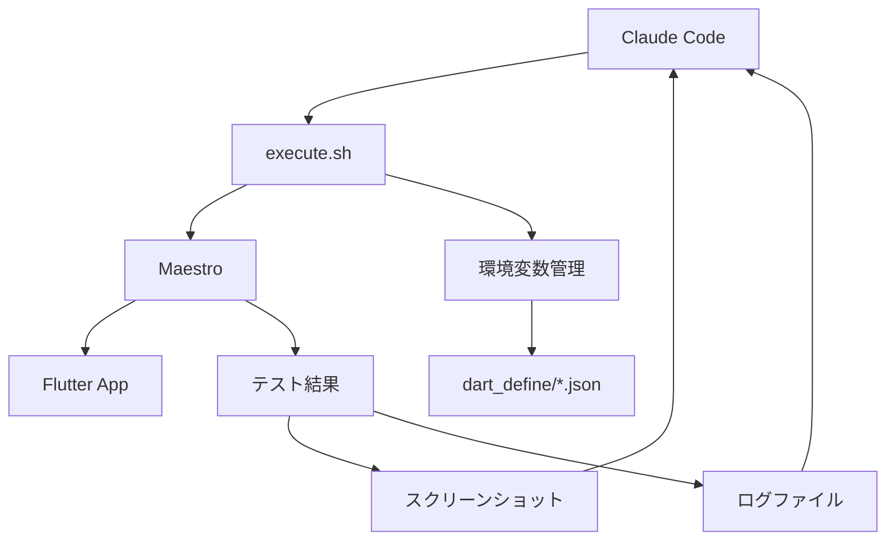

# Claude Code × Maestro UIテストワークフロー

本ドキュメントでは、Claude CodeとMaestroを組み合わせたFlutter UIテストの包括的なワークフローについて説明します。このアプローチは、反復的なUI開発プロセスを効率化し、高品質なモバイルアプリケーションの開発を支援します。

## 概要

### ワークフローの特徴

- **AI駆動の反復開発**: Claude Codeが失敗を分析し、改善策を提案
- **失敗前提の設計**: テスト失敗を学習の機会として活用
- **自動化されたデバッグ**: スクリーンショットとログによる視覚的問題分析
- **環境変数の動的管理**: flavorに応じた柔軟なテスト実行

### 技術スタック



## 基本ワークフロー

### フェーズ1: 要件分析とテスト設計

#### Claude Codeによる要件理解

```
ユーザー: "カウンターアプリのインクリメント機能をテストしたい"

Claude Code分析項目:
1. 必要なUI要素の特定
2. 期待される動作の理解
3. テスト観点の洗い出し
4. 既存テストとの関連性確認
```

#### テスト設計原則

1. **単一責任**: 1つのテストで1つの機能をテスト
2. **環境非依存**: `${FULL_APP_ID}`などの動的変数を使用
3. **可読性重視**: 分かりやすいアサーションとステップ名
4. **保守性**: 将来の変更に対応できる構造

### フェーズ2: テスト実装

#### 現代的なMaestroテストテンプレート

```yaml
# 基本テンプレート
appId: ${FULL_APP_ID}
---
- launchApp
- waitForAnimationToEnd
- assertVisible: '期待するUI要素'
- tapOn:
    text: 'ボタンテキスト'
- assertVisible: '結果状態'
```

#### 実践例：カウンターアプリテスト

```yaml
# counter_test.yaml
appId: ${FULL_APP_ID}
---
- launchApp
- assertVisible: 'Flutter Demo Home Page'
- assertVisible: 'カウンター: 0'
- tapOn:
    text: 'Increment'
- assertVisible: 'カウンター: 1'
- tapOn:
    text: 'Increment'
- assertVisible: 'カウンター: 2'
```

### フェーズ3: テスト実行とデバッグ

#### execute.shによる実行

```bash
# 基本実行
./execute.sh counter_test.yaml

# デバッグモード
./execute.sh --verbose --debug counter_test.yaml

# ウォッチモード（開発中）
./execute.sh --watch counter_test.yaml
```

#### 出力例と解釈

```
===== MAESTRO UI TEST RUNNER =====
[INFO] Flavor: development
[INFO] YAML file: counter_test.yaml
[INFO] Environment variables: FLAVOR=development, APP_ID=com.example.app, FULL_APP_ID=com.example.app.development

===== EXECUTING MAESTRO TEST =====
[INFO] Test artifacts will be saved to: test-output/20240703-123456
```

### フェーズ4: 失敗分析と改善

#### Claude Codeによる失敗分析プロセス

**1. ログ分析**

```bash
# 最新のテスト出力を確認
cat test-output/[最新タイムスタンプ]/maestro-output.log
```

**2. スクリーンショット分析**

```
Maestroが自動生成するスクリーンショットを確認
場所: ~/.maestro/tests/[テスト実行ID]/
```

**3. 一般的な失敗パターン**

| 失敗タイプ         | 症状                | Claude Code対応                                  |
| ------------------ | ------------------- | ------------------------------------------------ |
| 要素が見つからない | `Element not found` | UI要素のIDやテキストを確認、適切なセレクタに修正 |
| アプリ起動失敗     | `App launch failed` | FULL_APP_IDの確認、デバイス接続状態チェック      |
| タイムアウト       | `Timeout`           | 待機時間の調整、明示的な待機条件追加             |
| アニメーション干渉 | UI要素の状態不整合  | `waitForAnimationToEnd`の追加                    |

### フェーズ5: 継続的改善

#### ウォッチモードでの反復開発

```bash
# ファイル変更を監視して自動再実行
./execute.sh --watch counter_test.yaml
```

```
[INFO] Monitoring file changes for: counter_test.yaml
[INFO] Press Ctrl+C to exit watch mode

# ファイル保存時
[INFO] File changed, running test...
[実行結果]
[INFO] Waiting for file changes...
```

## 環境変数管理システム

### 動的変数生成の仕組み

#### パターン1: ID + SUFFIX組み合わせ

```json
{
  "APP_ID": "com.example.app",
  "APP_ID_SUFFIX": ".development"
}
```

→ `FULL_APP_ID=com.example.app.development`

#### パターン2: PREFIX + SUFFIX組み合わせ

```json
{
  "API_PREFIX": "https://api.staging",
  "API_SUFFIX": ".example.com"
}
```

→ `FULL_API=https://api.staging.example.com`

### Flavorによる環境切り替え

#### 設定ファイル構造

```
app/.dart_define/
├── development.json    # 開発環境
├── staging.json       # ステージング環境
└── production.json    # 本番環境
```

#### Flavor別テスト実行

```bash
# 開発環境（デフォルト）
./execute.sh counter_test.yaml

# ステージング環境
./execute.sh --flavor staging counter_test.yaml

# 本番環境
./execute.sh --flavor production counter_test.yaml
```

## 実践的なワークフロー例

### シナリオ: 新機能「お気に入りボタン」のテスト作成

#### 1. 要件確認

```
機能: 商品詳細画面にお気に入りボタンを追加
動作: ボタンタップで状態が切り替わり、ハートアイコンが変化
テスト観点: 初期状態、お気に入り追加、お気に入り削除
```

#### 2. Claude Codeによるテスト作成

```yaml
# favorite_button_test.yaml
appId: ${FULL_APP_ID}
---
# 商品詳細画面に移動
- launchApp
- tapOn:
    text: 'Products'
- tapOn:
    text: 'First Product'

# お気に入りボタンのテスト
- assertVisible: 'Product Details'
- assertVisible:
    id: 'favorite_button'

# 初期状態確認（お気に入りではない）
- assertVisible:
    id: 'favorite_icon_empty'

# お気に入りに追加
- tapOn:
    id: 'favorite_button'
- waitForAnimationToEnd
- assertVisible:
    id: 'favorite_icon_filled'

# お気に入りから削除
- tapOn:
    id: 'favorite_button'
- waitForAnimationToEnd
- assertVisible:
    id: 'favorite_icon_empty'
```

#### 3. 実行とデバッグ

```bash
# 初回実行（失敗想定）
./execute.sh --verbose favorite_button_test.yaml

# 失敗内容の分析
# → スクリーンショットでUI確認
# → ログでエラー詳細確認
# → Claude Codeが問題点を特定

# 修正と再実行
./execute.sh favorite_button_test.yaml
```

#### 4. 継続的改善

```bash
# ウォッチモードで開発継続
./execute.sh --watch favorite_button_test.yaml

# テスト成功後、他のケースも追加
# - 複数商品でのテスト
# - ネットワークエラー時の挙動
# - アプリ再起動後の状態保持
```

## 高度なテストパターン

### 複雑なUIフローテスト

#### ユーザー登録からログインまでの一連の流れ

```yaml
# user_registration_flow_test.yaml
appId: ${FULL_APP_ID}
---
# アプリ起動
- launchApp

# 登録画面への移動
- tapOn:
    text: 'Sign Up'

# 必要情報の入力
- tapOn:
    id: 'email_field'
- inputText: 'test@example.com'

- tapOn:
    id: 'password_field'
- inputText: 'password123'

- tapOn:
    id: 'confirm_password_field'
- inputText: 'password123'

# 利用規約同意
- tapOn:
    id: 'terms_checkbox'

# 登録実行
- tapOn:
    text: 'Create Account'

# 登録完了確認
- waitForAnimationToEnd
- assertVisible: 'Registration Successful'

# ログイン画面への移動
- tapOn:
    text: 'Login'

# ログイン実行
- inputText:
    text: 'test@example.com'
    id: 'login_email_field'

- inputText:
    text: 'password123'
    id: 'login_password_field'

- tapOn:
    text: 'Login'

# ダッシュボード表示確認
- waitForAnimationToEnd
- assertVisible: 'Welcome Dashboard'
```

### エラーハンドリングテスト

#### ネットワークエラー時の挙動テスト

```yaml
# network_error_test.yaml
appId: ${FULL_APP_ID}
---
# アプリ起動
- launchApp

# ネットワーク必須機能へアクセス
- tapOn:
    text: 'Sync Data'

# エラー状態の確認
- waitForAnimationToEnd:
    timeout: 10000

# エラーメッセージ表示確認
- assertVisible: 'Network Error'
- assertVisible: 'Please check your connection'

# リトライボタンのテスト
- tapOn:
    text: 'Retry'

# 再試行後の状態確認
- waitForAnimationToEnd:
    timeout: 5000
```

## デバッグとトラブルシューティング

### よくある問題と解決パターン

#### 1. 要素が見つからない問題

**問題の特定**

```
Assertion '"ボタン"' failed. Element not found.
```

**Claude Codeによる解決手順**

1. スクリーンショットでUI状態を確認
2. Flutter コードで要素のIDやテキストを確認
3. タイミング問題かどうか判断
4. 適切なセレクタに修正

**修正例**

```yaml
# 修正前（テキストが正確ではない）
- tapOn: 'ボタン'

# 修正後（正確なテキストまたはID使用）
- tapOn:
    text: 'Increment'
# または
- tapOn:
    id: 'increment_button'
```

#### 2. タイミング問題

**症状**

```
アニメーション中にタップして失敗
読み込み中に要素を探して失敗
```

**解決策**

```yaml
# アニメーション完了を待機
- waitForAnimationToEnd

# 明示的な要素待機
- waitUntilVisible:
    text: 'Content Loaded'
    timeout: 10000

# 長時間の処理待機
- extendedWaitUntilVisible:
    element: 'Processing Complete'
    timeout: 30000
```

#### 3. アプリ起動問題

**問題の特定**

```bash
# アプリIDの確認
./execute.sh --dry-run counter_test.yaml

# 出力例
Would execute: maestro test --env FULL_APP_ID=com.example.app.development counter_test.yaml
```

**解決手順**

1. デバイス/シミュレータでのアプリインストール状況確認
2. FULL_APP_IDが正しいか確認
3. アプリのビルドとインストール状態確認

### execute.shのデバッグオプション

#### 詳細ログ出力

```bash
# 基本的な詳細出力
./execute.sh --verbose counter_test.yaml

# Maestroのデバッグ出力も含む
./execute.sh --debug counter_test.yaml

# 実行前確認（ドライラン）
./execute.sh --dry-run counter_test.yaml

# 構文チェックのみ
./execute.sh --validate-only counter_test.yaml
```

#### 出力ファイルの分析

```bash
# 最新のテスト結果ディレクトリを表示
ls -la test-output/ | tail -1

# ログファイルの内容確認
cat test-output/[タイムスタンプ]/maestro-output.log

# エラー行のみ抽出
grep -i "error\|failed\|exception" test-output/[タイムスタンプ]/maestro-output.log
```

## ベストプラクティス

### テスト設計原則

#### 1. 適切な粒度

```yaml
# ✅ 良い例：単一機能のテスト
# login_test.yaml - ログイン機能のみテスト
appId: ${FULL_APP_ID}
---
- launchApp
- tapOn: 'Login'
- inputText:
    text: 'user@example.com'
    id: 'email_field'
- inputText:
    text: 'password'
    id: 'password_field'
- tapOn: 'Login Button'
- assertVisible: 'Dashboard'
# ❌ 悪い例：複数機能を一つのテストで
# 登録→ログイン→商品閲覧→購入まで一つのテストで実行
```

#### 2. 保守性の確保

```yaml
# ✅ 良い例：分かりやすいステップ名
- assertVisible: 'ユーザー名入力フィールド'
- inputText:
    text: 'test_user'
    id: 'username_field'

# ❌ 悪い例：不明確なセレクタ
- tapOn:
    point: '50%,60%'
- inputText: 'test'
```

#### 3. 環境変数の活用

```yaml
# ✅ 良い例：動的変数使用
appId: ${FULL_APP_ID}

# JavaScript内での環境変数活用
- evalScript: |
    const apiUrl = maestro.env.FULL_API;
    output.testUrl = apiUrl + '/test';

# ❌ 悪い例：ハードコーディング
appId: com.example.app.development
```

### CI/CD統合のための考慮事項

#### GitHub Actionsとの連携

```yaml
# .github/workflows/ui-tests.yml での活用例
- name: Run UI Tests
  run: |
    cd app/test/maestro
    ./execute.sh --no-continue counter_test.yaml
    ./execute.sh --no-continue login_test.yaml
```

#### テスト結果の保存

```bash
# CI環境でのアーティファクト保存
cp -r test-output/ $GITHUB_WORKSPACE/ui-test-artifacts/
```

## まとめ

Claude Code × Maestroワークフローは、以下の価値を提供します：

### 開発効率の向上

- **自動化された問題分析**: Claude Codeが失敗原因を特定し解決策を提案
- **反復的改善**: ウォッチモードによる即座のフィードバックループ
- **環境統一**: dart_define設定による一貫した環境管理

### 品質保証の強化

- **視覚的検証**: スクリーンショットによるUI状態の確認
- **包括的テスト**: 複数シナリオとエラーケースのカバー
- **回帰防止**: 継続的なテスト実行による品質維持

### チーム協働の促進

- **標準化されたプロセス**: 統一されたテスト作成・実行手順
- **知識共有**: ドキュメント化されたベストプラクティス
- **自動化**: 手動テストからの脱却

このワークフローを活用することで、高品質なFlutterアプリケーションを効率的に開発できます。
