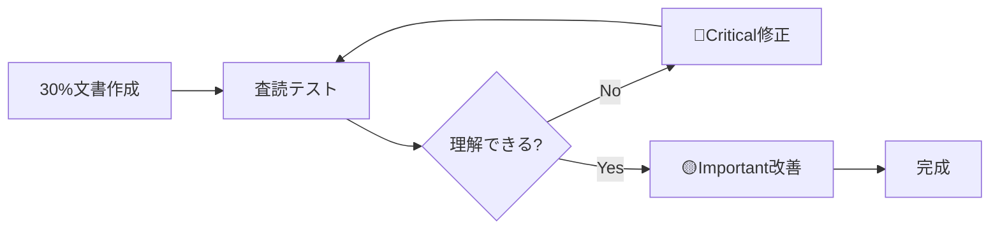
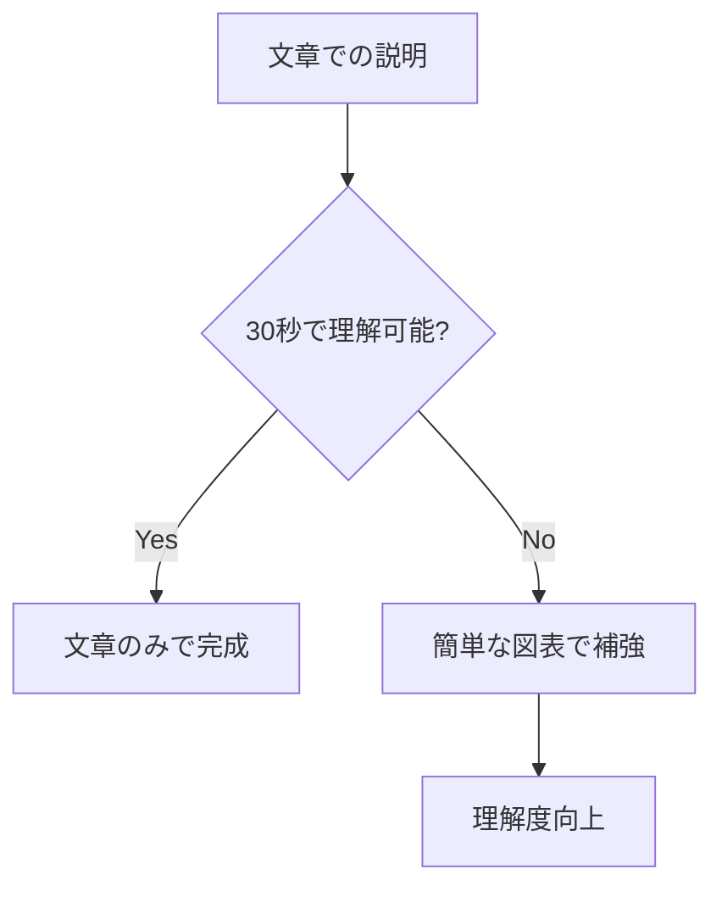
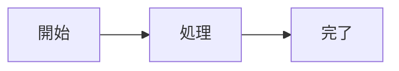
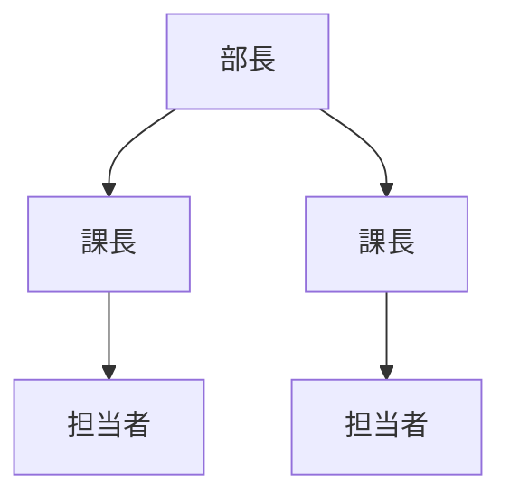
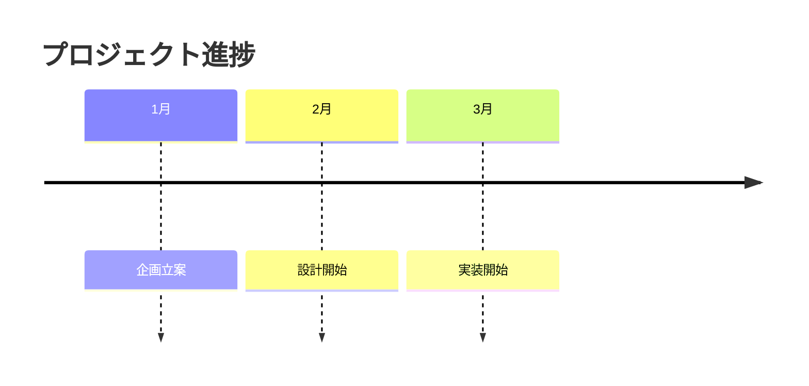

# 文書作成ガイドライン

## 目的

**30分で実用的な文書を作成し、読者に価値を提供する**ための汎用ガイドラインです。

**文章のみでは理解が困難な場合、図表で補強します。** ただし図表は必須ではなく、30%文書は文章のみでも十分価値があります。

## 最小手順（今すぐ実行）

1. **30%文書作成**：目的・要点・具体例のみで開始（30分以内）
2. **5分査読**：他者に読んでもらい理解度確認
3. **問題修正**：🔴理解阻害 → 🟡実用性 → 🟢見た目の順

## 文書種別テンプレート

### 説明文書（技術文書、マニュアル等）

```markdown
# [対象]の使い方

## 目的

[読者が達成したいことを1文、20字以内で]

## 手順

1. [最初の操作]
2. [必要最小限の設定]
3. [確認方法]

## 例

[実際に試せる具体例]
```

### 提案文書（企画書、改善提案等）

```markdown
# [提案名]

## 目的

[解決したい課題を1文で]

## 提案内容

1. [現状の問題]
2. [解決策の概要]
3. [期待される効果]

## 具体例

[実施イメージ・事例]
```

### 報告文書（進捗報告、調査結果等）

```markdown
# [報告対象]に関する報告

## 目的

[報告の目的を1文で]

## 要点

1. [最重要な結果/進捗]
2. [課題・問題点]
3. [次のアクション]

## 詳細

[データ・具体的内容]
```

---

## 核心原則：Draft-Test-Refactor



**用語説明：**

- **30%文書**：目的・要点・具体例のみの最小文書
- **Draft-Test-Refactor**：小さく作って査読で改善するサイクル

---

## 1. 品質基準（優先度順）

### 🔴 Critical（理解可能性）

- [ ] 目的が30秒で理解できる
- [ ] 最初の要点を把握できる
- [ ] 専門用語に説明がある

### 🟡 Important（実用性）

- [ ] 具体例が現実的で参考になる
- [ ] 問題発生時の対処法がある
- [ ] 想定読者レベルに適している

### 🟢 Nice（表現）

- [ ] 表記が統一されている
- [ ] 見出し階層が適切
- [ ] 図表が効果的に配置されている

---

## 2. 図表による理解度向上（オプション）

### 図表活用の判断基準

**文章で理解困難な場合のみ図表を追加**



### 文書種別ごとの図表活用例

| 文書種別   | 適した図表                   | 例                 |
| ---------- | ---------------------------- | ------------------ |
| 手順説明   | フローチャート               | 申請手続きの流れ   |
| 組織・関係 | 組織図、関係図               | 部署構成、責任範囲 |
| 時系列     | ガントチャート、タイムライン | プロジェクト進捗   |
| 比較分析   | 表、グラフ                   | 費用対効果比較     |

### 簡単な図表の作り方

**基本的な図表パターン（覚えやすい3種類）**

````markdown
# 手順・流れ説明用


````

# 組織・関係説明用



# 時系列説明用



---

## 3. よくある問題と対処法

### 問題1：「何から書けばいいかわからない」

**対処法：** 文書種別テンプレートから開始

```markdown
目的：[1文]
要点：[3項目以内]
具体例：[1つ以上]
```

### 問題2：「完璧を目指してしまう」

**対処法：** 時間制限を設定（30分で作成完了）

### 問題3：「査読が甘い」

**対処法：** 他者に5分で読んでもらい「理解できたか？」を確認

### 問題4：「技術的でない文書での図表活用が分からない」

**対処法：** 組織図、フローチャート、表から始める（Mermaid以外も活用）

---

## 4. 実践チェックリスト

### 作成時（30分以内）

- [ ] 目的を1文で記載
- [ ] 要点を3項目以内で記載
- [ ] 具体例を1つ以上記載
- [ ] 30分で作成完了
- [ ] 図表は理解困難な箇所のみ追加（オプション）

### 査読時（10分以内）

- [ ] 目的が30秒で理解できるか
- [ ] 要点が明確に伝わるか
- [ ] 専門用語が理解できるか
- [ ] 具体例が参考になるか

### 改善時（問題優先度順）

- [ ] 🔴Critical問題を即座に修正
- [ ] 🟡Important問題を次に改善
- [ ] 🟢Nice問題を最後に調整

---

## 5. 文書目的別活用指針

### 説明目的（理解してもらう）

- **重点**：分かりやすさ、具体例の充実
- **図表**：手順フロー、概念図
- **チェック**：専門用語の説明、段階的構成

### 説得目的（行動してもらう）

- **重点**：根拠の明確化、メリットの具体化
- **図表**：比較表、効果グラフ
- **チェック**：反対意見への配慮、実現可能性

### 記録目的（情報を残す）

- **重点**：事実の正確性、検索しやすさ
- **図表**：データ表、タイムライン
- **チェック**：日時・担当者の明記、更新履歴

### 指示目的（実行してもらう）

- **重点**：明確性、実行可能性
- **図表**：手順フロー、チェックリスト
- **チェック**：曖昧な表現の排除、完了条件の明示

---

## まとめ

**今日から実行できる3ステップ：**

1. **30%文書作成**（30分）：目的・要点・具体例のみ
2. **5分査読**：他者による理解度確認
3. **優先度修正**：🔴→🟡→🟢の順で改善

**最初は30%の完成度で十分です。図表は理解を助ける道具であり、必須ではありません。どんな種類の文書でも、読者のフィードバックが文書を価値あるものに育てます。**
