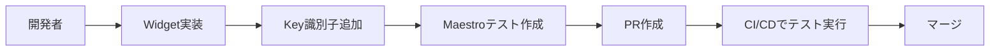

# MaestroテストフレームワークとFlutterアプリの統合

## 目的

FlutterアプリでUIテスト自動化を実現し、FloatingActionButtonのタップ動作を検証する

## 手順

1. **Maestro CLIのインストール**
2. **テスト設定ファイルの作成**
3. **実行と検証**

## 例

実際にカウンターアプリでFloatingActionButtonテストを実行

---

## 1. Maestro CLIのインストール

### インストールコマンド

```bash
# Maestro CLIのインストール（macOS/Linux）
curl -sL https://get.maestro.mobile.dev/install.sh | bash

# パスの設定
export PATH="$PATH":"$HOME/.maestro/bin"
```

### インストール確認

```bash
# インストール確認
maestro --version

# 利用可能なコマンド表示
maestro --help
```

**専門用語説明：**

- **Maestro**: FlutterやReact Nativeアプリ用のUIテスト自動化ツール
- **CLI**: Command Line Interface（コマンドライン操作）

---

## 2. テスト設定ファイルの作成

### ディレクトリ構成

```
project-root/
├── maestro/                    # Maestroテスト設定
│   └── counter_test.yaml      # カウンターテスト設定
├── .env.maestro              # 環境変数設定
└── app/
    └── lib/pages/home/
        └── home_page.dart    # テスト対象画面
```

### 環境変数設定（.env.maestro）

```bash
# アプリケーション設定
APP_ID=com.example.app
MAESTRO_TIMEOUT=30000
MAESTRO_LOG_LEVEL=INFO
```

### テスト設定ファイル（maestro/counter_test.yaml）

```yaml
appId: ${APP_ID}
---
- launchApp
- assertVisible: 'Flutter Demo Home Page'
- assertVisible: 'カウンター: 0'
- tapOn:
    id: 'FloatingActionButton'
- assertVisible: 'カウンター: 1'
- tapOn:
    id: 'FloatingActionButton'
- assertVisible: 'カウンター: 2'
```

### Widget側の対応（app/lib/pages/home/home_page.dart）

```dart
// FloatingActionButtonにKey識別子を追加
floatingActionButton: FloatingActionButton(
  key: const Key('FloatingActionButton'),  // ← この行を追加
  onPressed: _incrementCounter,
  tooltip: 'Increment',
  child: const Icon(Icons.add),
),
```

**専門用語説明：**

- **Key**: FlutterでWidget識別に使用する一意な識別子
- **assertVisible**: 画面上に指定要素が表示されているかを検証
- **tapOn**: 指定要素をタップする操作

---

## 3. 実行と検証

### テスト実行手順

```bash
# 1. アプリを起動（デバイス/エミュレータ上で）
cd app
flutter run

# 2. 別ターミナルでMaestroテスト実行
maestro test --env='APP_ID=com.example.app' maestro/counter_test.yaml
```

### 実行成功例

```
✅ Launch app com.example.app
✅ Assert visible "Flutter Demo Home Page"
✅ Assert visible "カウンター: 0"
✅ Tap on FloatingActionButton
✅ Assert visible "カウンター: 1"
✅ Tap on FloatingActionButton
✅ Assert visible "カウンター: 2"

Flow completed successfully 🎉
```

### よくある問題と対処法

| 問題                | 原因                        | 対処法                                  |
| ------------------- | --------------------------- | --------------------------------------- |
| `App not found`     | アプリが起動していない      | `flutter run`でアプリを先に起動         |
| `Element not found` | Key識別子が設定されていない | Widget に`key: const Key('名前')`を追加 |
| `Timeout`           | アプリの応答が遅い          | `.env.maestro`でタイムアウト時間を延長  |

---

## 4. 高度な活用例

### 複数画面のテスト

```yaml
appId: ${APP_ID}
---
- launchApp
- assertVisible: 'Flutter Demo Home Page'

# ホーム画面でのテスト
- tapOn:
    id: 'FloatingActionButton'
- assertVisible: 'カウンター: 1'

# 設定画面への遷移テスト
- tapOn:
    id: 'SettingsButton'
- assertVisible: '設定'
- tapOn: '戻る'
- assertVisible: 'Flutter Demo Home Page'
```

### 条件分岐テスト

```yaml
# カウンターが特定値の時の動作テスト
- runFlow:
    when:
      visible: 'カウンター: 5'
    commands:
      - assertVisible: '最大値に達しました'
```

---

## 5. CI/CDパイプライン統合

### GitHub Actions例

```yaml
name: Maestro UI Tests
on: [push, pull_request]

jobs:
  ui-tests:
    runs-on: macos-latest
    steps:
      - uses: actions/checkout@v3

      - name: Setup Flutter
        uses: subosito/flutter-action@v2

      - name: Install Maestro
        run: curl -sL https://get.maestro.mobile.dev/install.sh | bash

      - name: Build app
        run: |
          cd app
          flutter build apk --debug

      - name: Start emulator
        run: # エミュレータ起動コマンド

      - name: Run Maestro tests
        run: |
          export PATH="$PATH":"$HOME/.maestro/bin"
          maestro test maestro/
```

---

## 6. 開発チーム向けベストプラクティス

### テスト作成時の注意点

1. **識別子の一貫性**: 全てのテスト対象Widgetには明確なKeyを設定
2. **テストの独立性**: 各テストファイルは独立して実行可能にする
3. **待機時間の最適化**: 不要な待機は避け、必要な箇所のみタイムアウト設定

### チーム開発での活用



### 効果的なテスト戦略

- **段階的導入**: 重要画面から順次テスト追加
- **リグレッションテスト**: 修正後の既存機能動作確認
- **クロスプラットフォーム**: iOS/Android両方での動作検証

---

## まとめ

**今日から実行できる3ステップ：**

1. **Maestro CLI インストール**（5分）：開発環境にツール導入
2. **テスト設定作成**（15分）：YAMLファイルとWidget Key設定
3. **テスト実行確認**（10分）：実際の動作検証

**最初は1つのボタンテストから始めて、段階的に複雑なシナリオに拡張することで、確実にUIテスト自動化を導入できます。チーム全体の開発効率向上とバグ検出精度向上を実現します。**
