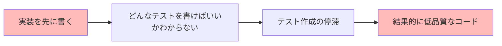
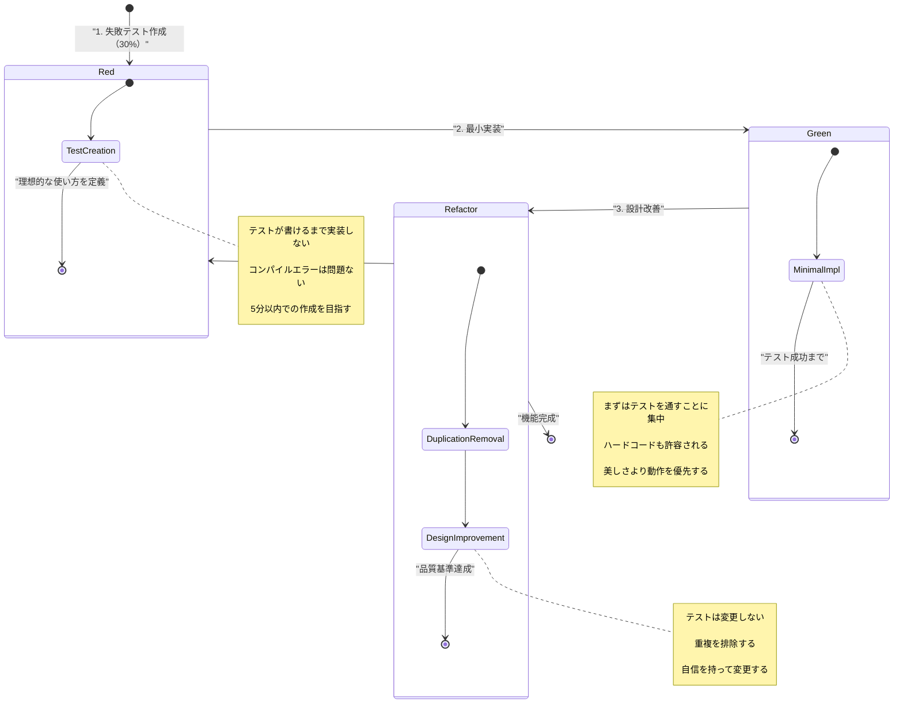
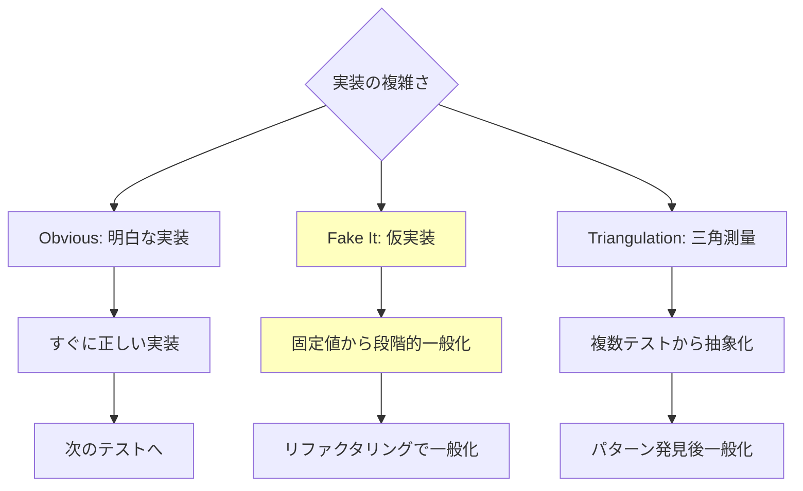
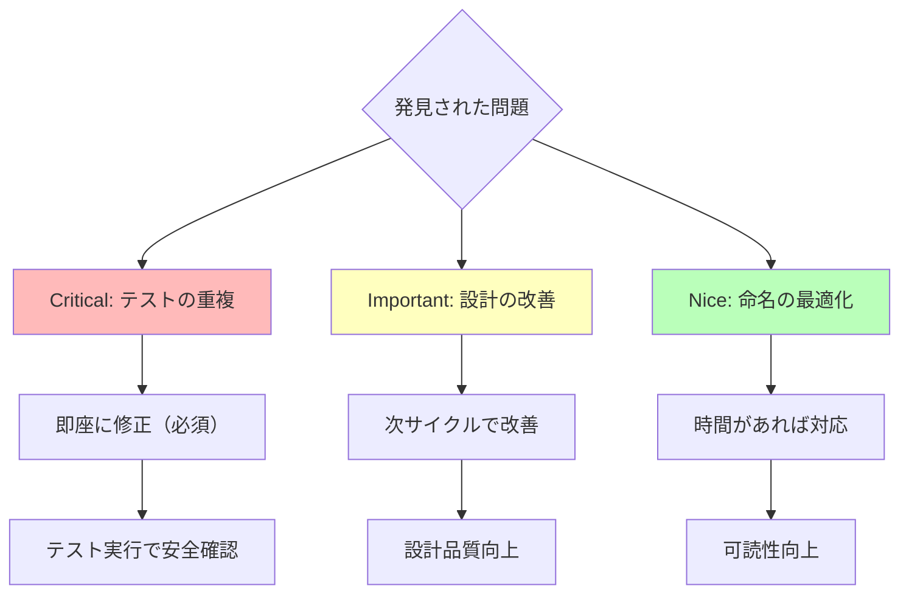
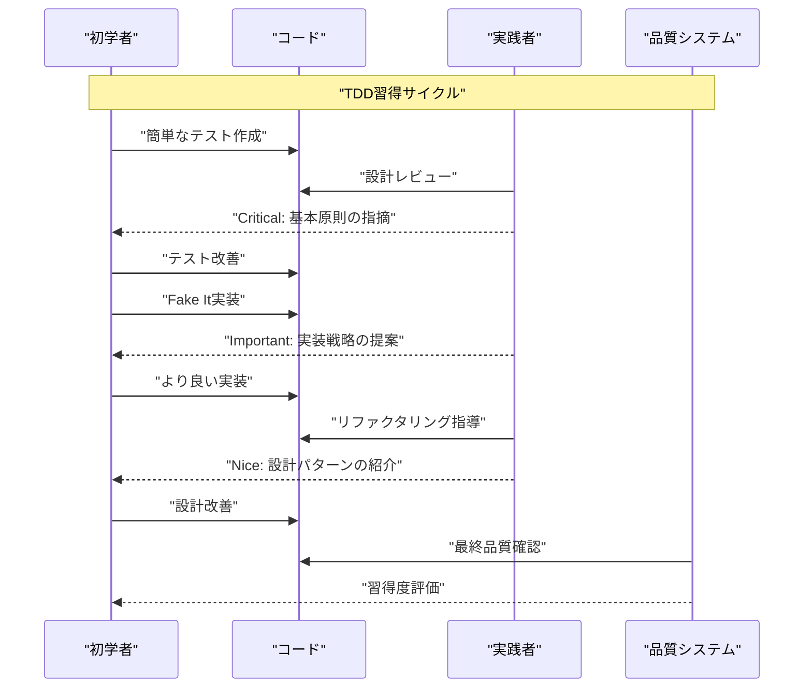
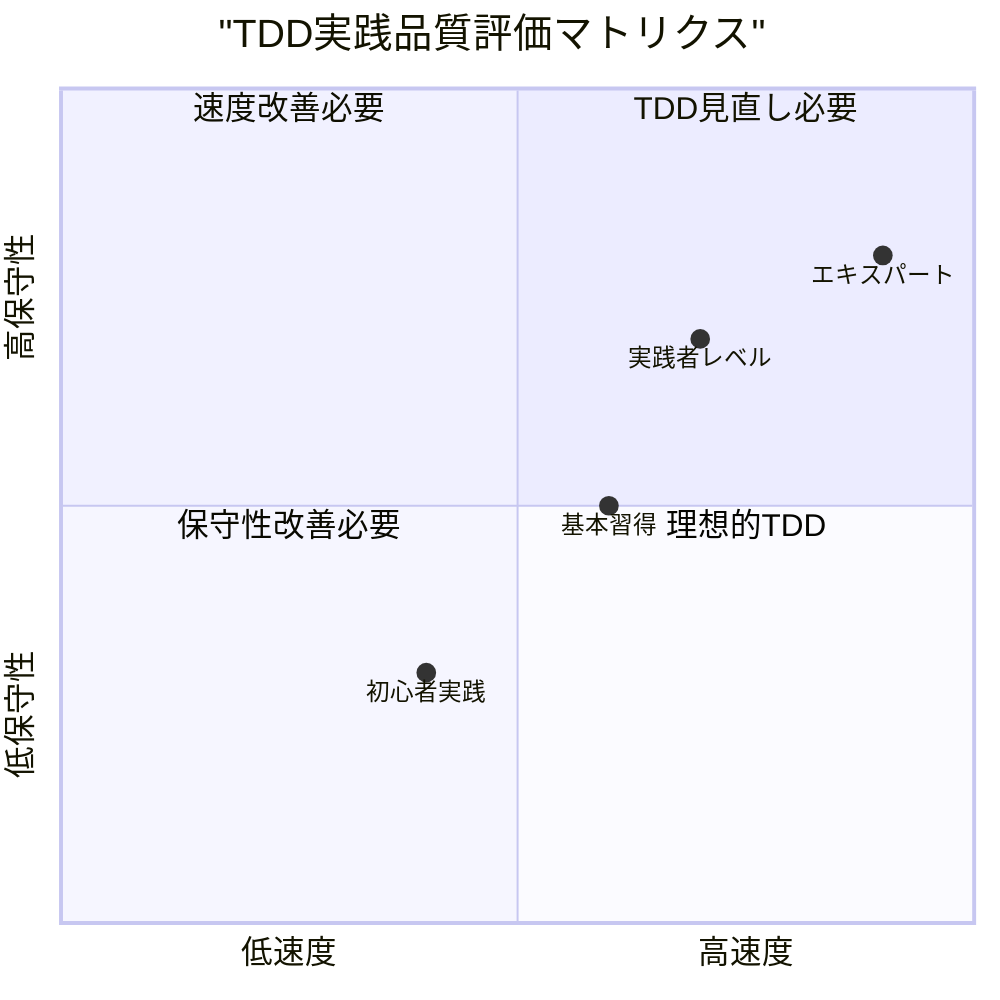
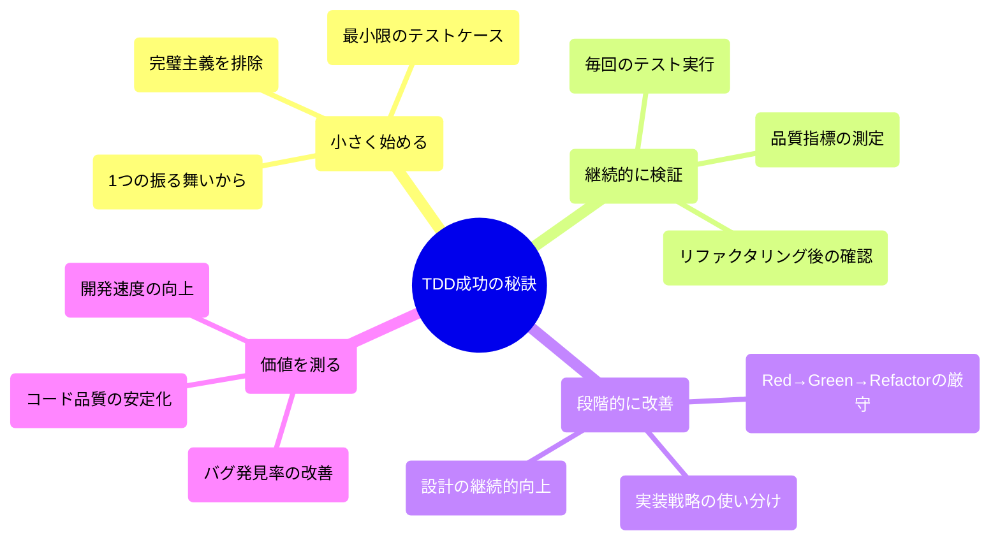

# テスト駆動開発（TDD）実践ガイド

## 本文書の目的

**10分でTDDの核心を理解し、今日から実践できる**ガイドです。テストを先に書くことで、より良い設計と信頼性の高いコードを効率的に開発できます。

## 核心原則：Red-Green-Refactor

**「失敗テスト作成（Red） → 最小実装（Green） → 設計改善（Refactor）」**

### 30%テストとは？

最小限のテストケースから始めるアプローチ。完璧を求めず、まず動くものを作ることが重要です。

## 初学者向けクイックスタート（今すぐ試せる）

### 最初のTDDサイクル（10分）

```javascript
// 1. Red：失敗テストを書く（5分）
test('数値を2倍にする', () => {
  expect(double(5)).toBe(10)
})
// → double関数が存在しないので失敗

// 2. Green：最小実装（3分）
function double(n) {
  return 10 // ハードコードでOK
}
// → テスト成功

// 3. Refactor：一般化（2分）
function double(n) {
  return n * 2 // 正しい実装に改善
}
```

## なぜテスト駆動開発が必要なのか？

### 問題：従来の「実装優先」アプローチ



### 解決：TDD的「テスト優先」アプローチ

| TDD原則                    | 開発での実践          | 即座のメリット     |
| -------------------------- | --------------------- | ------------------ |
| **小さなステップ**         | 1つの振る舞いから開始 | 今日から実行可能   |
| **テスト駆動**             | 失敗テストを先に定義  | 明確な成功基準     |
| **継続的リファクタリング** | 安全な設計改善        | 恐怖なく変更できる |

## 1. TDD的開発の3フェーズ：Red-Green-Refactor

### 基本サイクルの可視化



### 各フェーズの実践方法

#### 🔴 Red（失敗テスト）：理想的な使い方の定義

**実践例1：電卓機能の30%テスト**

```typescript
// 30%テスト：最小限の期待値定義
describe('Calculator', () => {
  it('2つの数を足し算できる', () => {
    const calculator = new Calculator()
    const result = calculator.add(2, 3)
    expect(result).toBe(5)
  })
})

// この時点でCalculatorクラスは存在しない
// コンパイルエラーは期待通りの「Red」状態
```

**実践例2：ユーザー認証の30%テスト**

```typescript
// 30%テスト：基本的な成功ケースのみ
describe('UserAuth', () => {
  it('正しい認証情報でログイン成功', () => {
    const auth = new UserAuth()
    const result = auth.login('user@example.com', 'password123')
    expect(result.success).toBe(true)
  })
})

// エラーケースやバリデーションは次のサイクルで追加
```

**30%テスト作成の判定基準**

- [ ] 1つの振る舞いを明確に表現できている
- [ ] 実装が存在しなくてもテストの意図が理解できる
- [ ] 5分以内で記述可能な最小限の期待値

### F.I.R.S.T.原則：良いテストの基準

- **F**ast：高速実行（0.1秒以内）
- **I**ndependent：独立性（他のテストに依存しない）
- **R**epeatable：再現性（何度でも同じ結果）
- **S**elf-validating：自己検証（成功/失敗が明確）
- **T**imely：適時性（実装前に書く）

#### 🟢 Green（最小実装）：テスト成功のための最短経路

**検証可能な実装基準**

```yaml
# 最小実装品質のユニットテスト（5分で実施）
implementation_check:
  functionality:
    - [ ] テストが緑になっている
    - [ ] コンパイルエラーが解消されている
    - [ ] 意図した振る舞いを実現している

  simplicity:
    - [ ] 最も簡単な実装を選択している
    - [ ] 不要な複雑さを含んでいない
    - [ ] 必要に応じてハードコードを使用している

# 成功例：✅ テスト通過、✅ 最小実装、✅ 素早い完了
```

**実装戦略の選択**



#### 🔵 Refactor（設計改善）：安全な品質向上

**改善の実行順序**



## 2. 効果的なTDD実践プロセス

### 初学者と実践者の役割分担

| 役割                 | 初学者のアプローチ       | 実践者のアプローチ       |
| -------------------- | ------------------------ | ------------------------ |
| **Redフェーズ**      | 簡単な成功ケースから開始 | エッジケースも含めて設計 |
| **Greenフェーズ**    | Fake Itで確実に成功体験  | 状況に応じて戦略選択     |
| **Refactorフェーズ** | 明らかな重複のみ除去     | 設計パターンを積極活用   |

### 段階的TDD習得フレームワーク



### 構造化TDD基準

#### 🔴 高優先度：テスト作成能力の確保

**検証項目（400文字以内でチェック）**

| チェック項目       | 合格基準            | 失敗時の対応           |
| ------------------ | ------------------- | ---------------------- |
| **テストの明確性** | 1つの振る舞いに集中 | テストを分割して再作成 |
| **実装独立性**     | 実装なしで理解可能  | テストの表現を改善     |
| **失敗確認**       | 期待通りに失敗する  | 実装がないことを確認   |

#### 🟡 中優先度：実装品質の向上

**改善の観点**

```yaml
implementation_improvement:
  strategy:
    - [ ] 適切な実装戦略を選択している
    - [ ] 最小限の変更でテストを通している
    - [ ] 設計の意図が明確に表現されている

  quality:
    - [ ] コードの可読性が高い
    - [ ] 責任が適切に分離されている
    - [ ] 将来の拡張性を考慮している
```

#### 🟢 低優先度：開発体験の最適化

**最適化要素**

| 改善項目                 | 実施基準           | 自動化可能性          |
| ------------------------ | ------------------ | --------------------- |
| **テスト実行速度**       | 0.1秒以内/テスト   | ✅ 自動測定可能       |
| **命名の一貫性**         | チーム規約を遵守   | ⚠️ リンターで設定可能 |
| **リファクタリング頻度** | 3回目のRed前に実施 | ⚠️ 人間の判断が必要   |

## 3. 継続的TDD改善とメトリクス

### TDD品質の定量評価



### TDD的開発改善のKPI

| メトリクス               | 測定方法               | 目標値    | 達成時のアクション       |
| ------------------------ | ---------------------- | --------- | ------------------------ |
| **サイクル速度**         | Red→Green→Refactor時間 | 10分以内  | より複雑な機能に挑戦する |
| **テスト品質**           | F.I.R.S.T.原則の遵守率 | 95%以上   | チーム標準として展開する |
| **リファクタリング頻度** | Green後の改善実施率    | 80%以上   | 設計パターンを学習する   |
| **習得速度**             | 基本サイクル完了まで   | 1週間以内 | 実プロジェクトに適用する |

## 4. 今すぐ始められるアクションプラン

### 段階別実践ステップ

#### 💡 今日（30分）：TDD開発を体験

**初学者向け：**

- [ ] 簡単な機能（足し算など）で1つのテストを作成する
- [ ] Red → Green → Refactorを1回完了する
- [ ] 各フェーズの時間を測定する（Red: 5分、Green: 10分、Refactor: 15分）

**実践者向け：**

- [ ] より複雑な機能でTDDサイクルを実践する
- [ ] 複数の実装戦略（Fake It、Obvious、Triangulation）を試す
- [ ] リファクタリングで設計パターンを適用する

#### 📚 今週（3日）：基本パターンの習得

**初学者向け：**

- [ ] Red-Green-Refactorを10回実践する
- [ ] F.I.R.S.T.原則に従ったテストを作成する
- [ ] 基本的な実装戦略を使い分ける

**実践者向け：**

- [ ] 複雑なビジネスロジックにTDDを適用する
- [ ] テストダブル（Mock、Stub）を活用する
- [ ] CI/CDパイプラインに統合する

#### 🏢 今月（継続的改善）：TDD文化の確立

**チーム全体：**

- [ ] TDD実践基準をチームで統一する
- [ ] コードレビューにTDD観点を追加する
- [ ] 定期的なTDDモブプログラミングを開催する

### TDD成功パターンの可視化



## まとめ：TDDで「信頼できるコード」を構築する

### 核心価値の再確認

1. **恐怖の管理**：テストファーストで不安を具体的な行動に変換する
2. **品質中心**：継続的な検証により信頼性を確保する
3. **検証可能な改善**：客観的指標により段階的に技術を向上させる
4. **持続可能な開発**：変化する要求に柔軟に対応する

### 行動への転換

従来の「実装してからテスト」から「テストを書いてから実装」への転換により、真に信頼できるソフトウェアを効率的に開発できます。

**今日から始めましょう。最初のテストは30%の完成度で十分です。失敗することから始まるのがTDDの第一歩です。**

---

## 付録：実践的チェックリストとテンプレート

### 30%テスト作成テンプレート

```javascript
// [機能名]（30%テスト）

describe('[クラス名]', () => {
  it('[期待する振る舞い]', () => {
    // Given: 前提条件（1-2行）
    const target = new [クラス名]();

    // When: 実行（1行）
    const result = target.[メソッド名]([引数]);

    // Then: 検証（1行）
    expect(result).toBe([期待値]);
  });
});

// 実装戦略選択指針：
// - 簡単: Obvious Implementation
// - 少し複雑: Fake It → 段階的一般化
// - 複雑: Triangulation（複数テストケース）
```

### 言語別テストフレームワーク例

```javascript
// JavaScript/TypeScript: Jest, Mocha, Vitest
// Python: pytest, unittest
// Java: JUnit
// C#: NUnit, xUnit
// Ruby: RSpec
// Go: testing package
```

### TDD実践チェックリスト（定量的評価基準）

```yaml
tdd_practice_checklist:
  red_phase:
    - [ ] テストが失敗することを確認する（実行結果Red）
    - [ ] 1つの振る舞いに集中している（単一責任原則）
    - [ ] 実装なしで意図が理解できる（可読性8/10点以上）

  green_phase:
    - [ ] テストが成功することを確認する（実行結果Green）
    - [ ] 最小限の変更で実装されている（差分10行以内）
    - [ ] 実装戦略が適切に選択されている（初心者はFake It推奨）

  refactor_phase:
    - [ ] テストが引き続き成功している（回帰テストをクリア）
    - [ ] コードの重複が除去されている（DRY原則を遵守）
    - [ ] 設計が改善されている（可読性・保守性が向上）

# TDDサイクル時間の目安
cycle_time_allocation:
  red_phase: 5分（テスト作成・失敗確認）
  green_phase: 10分（最小実装・成功確認）
  refactor_phase: 15分（重複除去・設計改善）
  total: 30分以内（1サイクル完了）
```
