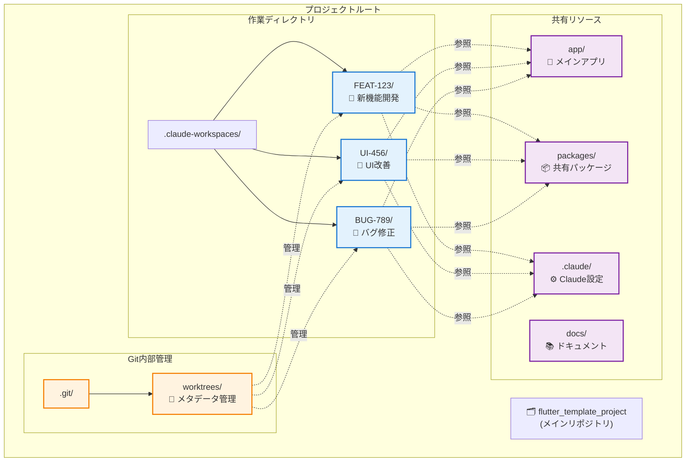
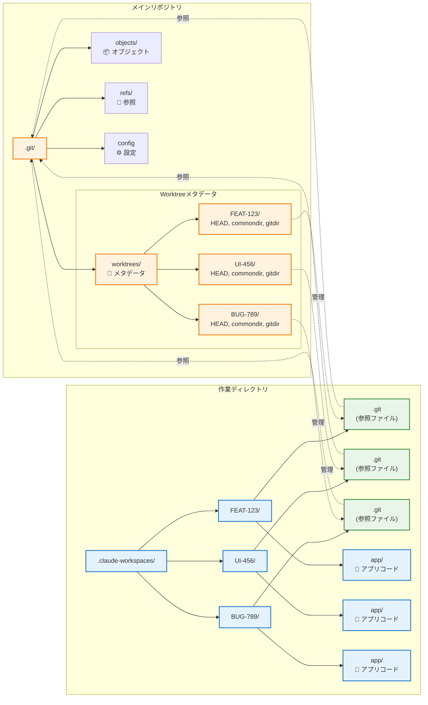
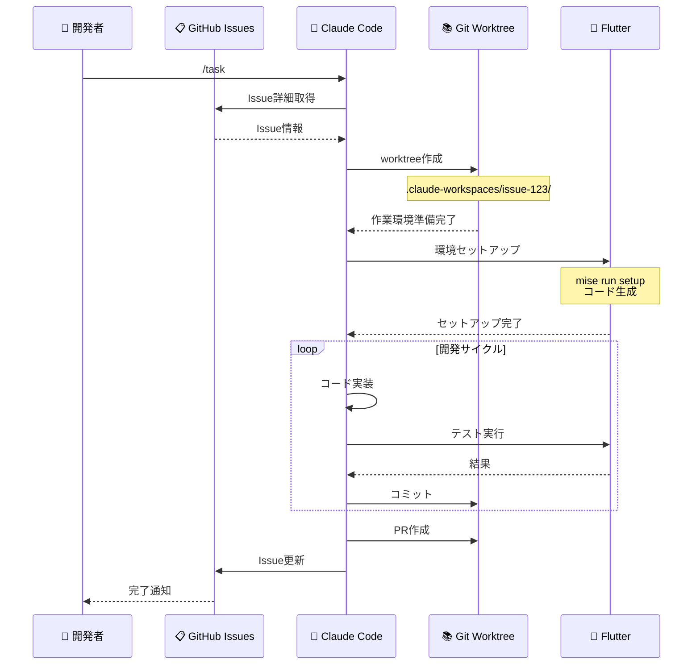
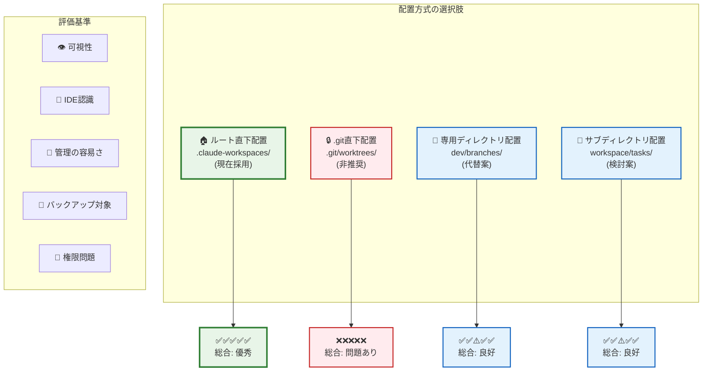
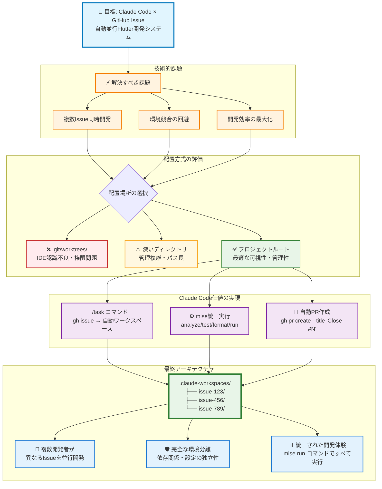

# Claude Code Git Worktree アーキテクチャ設計書

## 文書概要

本文書では、Claude CodeとGitHub Issueを統合したFlutter並行開発システムにおける、git worktreeアーキテクチャの設計思想と実装詳細を解説します。

### 設計目標

- **並行開発の実現**: 複数のGitHub Issueを同時並行で安全に開発
- **環境独立性の確保**: タスク間での干渉・競合状態の完全排除
- **開発効率の最大化**: 統一されたツールチェーンによる開発体験の向上
- **保守性の担保**: 明確なディレクトリ構造による管理コストの削減

### アーキテクチャ方針

`.claude-workspaces`ディレクトリをプロジェクトルートに配置することで、Git内部構造との分離、IDE認識の最適化、管理スクリプトの簡素化を実現します。各GitHub Issueは独立したワークスペースを持ち、mise による統一されたタスク実行環境で動作します。

## 目次

1. [現在の配置方針](#現在の配置方針)
2. [.gitディレクトリ直下への配置が問題となる理由](#gitディレクトリ直下への配置が問題となる理由)
3. [ルートディレクトリ配置の利点](#ルートディレクトリ配置の利点)
4. [技術的考慮事項](#技術的考慮事項)
5. [代替案との比較](#代替案との比較)
6. [まとめ](#まとめ)

## 現在の配置方針

### ディレクトリ構造

```bash
flutter_template_project/
├── .claude-workspaces/          # ✅ ルート直下に配置（推奨）
│   ├── FEAT-123/                # タスク1の独立作業ディレクトリ
│   ├── UI-456/                  # タスク2の独立作業ディレクトリ
│   └── BUG-789/                 # タスク3の独立作業ディレクトリ
├── .git/                        # Git内部管理用
│   ├── worktrees/              # ⚠️ Gitの内部管理用（既存）
│   ├── refs/
│   ├── objects/
│   └── config
├── .vscode/                     # VS Code設定
│   └── settings.json
├── app/                         # メインFlutterアプリケーション
│   ├── lib/                     # Dartソースコード
│   │   ├── pages/              # UI ページ
│   │   ├── router/             # go_router設定
│   │   └── i18n/               # slang生成多言語ファイル
│   ├── assets/i18n/            # JSON翻訳ファイル
│   ├── test/                   # ウィジェットテスト
│   └── [platform]/             # プラットフォーム固有ファイル
├── packages/                    # 共有パッケージ（現在空）
├── docs/                        # プロジェクトドキュメント
│   ├── CLAUDE_4_BEST_PRACTICES.md
│   ├── COMMITLINT_RULES.md
│   └── WORKTREE_ARCHITECTURE.md
├── scripts/                     # ビルド・ユーティリティスクリプト
├── pubspec.yaml                 # ワークスペース設定
├── package.json                 # Node.js依存関係
└── LICENSE                      # MITライセンス
```

### Git Worktreeアーキテクチャ概要



## .gitディレクトリ直下への配置が問題となる理由

### 1. 隠しディレクトリによるアクセシビリティ問題

#### 問題のある配置例

```bash
flutter_template_project/
├── .git/
│   ├── worktrees/              # ❌ 隠しディレクトリ内で見えにくい
│   │   ├── feature-FEAT-123/
│   │   └── feature-UI-456/
```

#### 具体的な問題

- **ファイルマネージャー**: 多くのツールで隠しディレクトリが表示されない
- **開発者体験**: 作業場所が把握しにくい
- **新規参加者**: プロジェクト構造の理解が困難

### 2. IDE・エディタの認識問題

#### VS Code での問題例

```json
// .vscode/settings.json が正しく認識されない
{
  "dart.flutterSdkPath": "/path/to/flutter",
  "dart.analysisServerFolder": ".dart_tool"
}
```

#### IntelliJ IDEA での問題例

```bash
.git/worktrees/feature-FEAT-123/app/
# ↑ IDEがプロジェクトルートとして認識しにくい
# ↑ Flutter SDKの検出に失敗する可能性
# ↑ 設定ファイル（.idea/）が正しく動作しない
```

#### 影響範囲

- Flutter SDK の自動検出失敗
- デバッガーやホットリロードの問題
- プラグインや拡張機能の誤動作
- コード補完・解析機能の低下

### 3. Git内部構造との競合

#### Gitの既存構造

```bash
.git/
├── worktrees/                  # ⚠️ Gitが既に使用中
│   ├── feature-FEAT-123/       # worktreeのメタデータ
│   │   ├── HEAD               # ブランチ参照
│   │   ├── commondir          # 共通ディレクトリ参照
│   │   ├── gitdir             # .gitディレクトリ参照
│   │   └── locked             # ロック状態
```

#### 競合による問題

- **名前空間の衝突**: 同名ディレクトリでの混乱
- **内部コマンドの誤動作**: `git worktree prune`等での予期しない動作
- **メタデータの破損リスク**: Git更新時の互換性問題
- **デバッグの困難**: 内部ファイルと作業ファイルの区別が困難

### 4. バックアップ・同期ツールでの除外

#### 一般的なバックアップ設定

```bash
# rsyncでの除外設定
rsync --exclude='.git' source/ dest/
# ↑ .git配下のworktreesも除外されてしまう

# .gitignore_global
.git/
# ↑ 多くの同期ツールで除外対象
```

#### 影響するツール

- **クラウド同期**: Google Drive, Dropbox, OneDrive
- **バックアップソフト**: Time Machine, Carbon Copy Cloner
- **CI/CDシステム**: GitHub Actions, GitLab CI

### 5. 権限・セキュリティ問題

#### 権限設定の制約

```bash
# .gitディレクトリの一般的な権限
drwxr-xr-x  .git/                # 読み取り制限

# 作業ディレクトリに必要な権限
drwxrwxrwx  worktrees/feature-FEAT-123/  # 読み書き実行権限
```

#### セキュリティポリシーでの制約

- 企業環境での`.git`アクセス制限
- セキュリティソフトによる隠しディレクトリ監視
- CI/CDでの権限エラー

### 6. 管理スクリプトの複雑化

#### 現在のスクリプト（シンプル）

```bash
# scripts/manage-flutter-tasks.sh
for workspace in .claude-workspaces/*/; do
    if [ -d "$worktree" ]; then
        cd "$worktree"
        flutter analyze
        cd - > /dev/null
    fi
done
```

#### .git配下の場合（複雑）

```bash
# 複雑な処理が必要
for worktree in .git/worktrees/*/; do
    # 隠しディレクトリチェック
    if [[ "$(basename "$worktree")" != "."* ]]; then
        # 権限チェック
        if [ -r "$worktree" ] && [ -w "$worktree" ]; then
            # Git内部ファイルとの区別
            if [ -f "$worktree/app/pubspec.yaml" ]; then
                cd "$worktree"
                flutter analyze
                cd - > /dev/null
            fi
        fi
    fi
done
```

## ルートディレクトリ配置の利点

### 1. 明確な可視性

```bash
flutter_template_project/
├── .claude-workspaces/          # ✅ 一目で作業ディレクトリと分かる
│   ├── issue-123/               # ✅ 各GitHub Issueが明確
│   └── issue-456/               # ✅ 進行中のタスクが把握しやすい
```

### 2. IDE・エディタでの適切な認識

```bash
# VS Codeでの認識例
.claude-workspaces/issue-123/
├── .vscode/                     # ✅ 設定ファイルが正しく動作
├── app/lib/                     # ✅ Dartコード解析が正常
├── pubspec.yaml                 # ✅ Flutter SDKが正しく検出
└── analysis_options.yaml       # ✅ Lintルールが適用
```

### 3. 並行開発での独立性

```bash
# 各GitHub Issueが完全に独立
cd .claude-workspaces/issue-123  # GitHub Issue #123: 新機能開発
mise run test                     # テスト実行

cd ../issue-789                  # GitHub Issue #789: バグ修正
mise run test                    # テスト実行
```

### 4. 管理スクリプトでの効率的な処理

```bash
# シンプルで効率的な処理
./scripts/manage-flutter-tasks.sh list
# ↓
📋 Active Flutter Tasks:
   - FEAT-123: ✅ Running (Android)
   - UI-456:   ✅ Running (iOS)
   - BUG-789:  🧪 Testing
```

### 5. 共通リソースへの適切なアクセス

```bash
.claude-workspaces/issue-123/
├── app/                         # このGitHub Issue専用のFlutterアプリ
├── packages/                    # 共有パッケージ
├── ../../.vscode/               # ✅ 共通のVS Code設定
├── ../../scripts/               # ✅ 共通の管理スクリプト
├── ../../docs/                  # ✅ 共通ドキュメント
└── ../../CLAUDE.md              # ✅ Claude Code設定
```

## 技術的考慮事項

### 1. Git Worktreeの仕組み

#### Git Worktree内部構造図



#### 内部動作

```bash
# worktree作成時の内部処理
git worktree add .claude-workspaces/FEAT-123 feature/FEAT-123

# 内部で作成されるファイル
.git/worktrees/FEAT-123/
├── HEAD                        # ブランチ参照
├── commondir                   # ../../
├── gitdir                      # .claude-workspaces/FEAT-123/.git
└── locked                      # 使用中フラグ
```

#### worktreeディレクトリの構造

```bash
.claude-workspaces/FEAT-123/
├── .git                        # → .git/worktrees/FEAT-123/への参照
├── app/                        # Flutterアプリケーション
├── packages/                   # 共有パッケージ
└── docs/                       # ドキュメント
```

### 2. Claude Codeとの連携

#### 並行開発フロー図



#### プロセス管理での利点

```bash
# PIDファイルでの管理
pids/
├── claude-flutter-issue-123.pid  # ✅ GitHub Issue IDが明確
├── claude-flutter-issue-456.pid  # ✅ プロセス特定が容易
└── claude-flutter-issue-789.pid  # ✅ 管理スクリプトで一元処理
```

#### ログ管理での利点

```bash
# ログファイルでの追跡
logs/
├── claude-flutter-issue-123.log  # ✅ GitHub Issue別ログが明確
├── claude-flutter-issue-456.log  # ✅ デバッグが容易
└── claude-flutter-issue-789.log  # ✅ 進捗監視が効率的
```

### 3. リソース管理

#### メモリ・CPU使用量

```bash
# 各GitHub Issue対応ワークスペースでの独立実行
.claude-workspaces/issue-123/: CPU 15.2%, MEM 8.1%
.claude-workspaces/issue-456/: CPU 8.7%, MEM 5.3%
.claude-workspaces/issue-789/: CPU 12.1%, MEM 6.8%
```

#### ディスク使用量

```bash
# 効率的な容量管理
du -sh .claude-workspaces/*/
480M    .claude-workspaces/issue-123/
320M    .claude-workspaces/issue-456/
180M    .claude-workspaces/issue-789/
```

## 配置方式の比較分析

### 配置方式比較表



## 代替案との比較

### 1. 現在の方式（推奨）

```bash
flutter_template_project/
├── .claude-workspaces/          # ✅ ルート直下
```

**利点:**

- ✅ 明確な可視性
- ✅ IDE・エディタでの適切な認識
- ✅ 管理スクリプトのシンプル性
- ✅ バックアップ・同期の容易性

### 2. .git直下配置（非推奨）

```bash
flutter_template_project/
├── .git/
│   ├── worktrees/              # ❌ 隠しディレクトリ
```

**問題点:**

- ❌ 隠しディレクトリで見えにくい
- ❌ IDE・エディタでの認識問題
- ❌ Git内部構造との競合
- ❌ バックアップから除外される

### 3. 専用ディレクトリ配置（代替案）

```bash
flutter_template_project/
├── dev/
│   ├── branches/               # 🔄 代替可能
```

**評価:**

- 🔄 可視性は良好
- 🔄 管理の複雑化
- 🔄 既存スクリプトの変更が必要

### 4. サブディレクトリ配置（検討案）

```bash
flutter_template_project/
├── workspace/
│   ├── tasks/                  # 🔄 階層が深い
```

**評価:**

- 🔄 構造は整理される
- 🔄 パスが長くなる
- 🔄 Claude Codeスクリプトの修正が必要

## まとめ

### ルートディレクトリ配置を選択する理由

1. **開発者体験の向上**
   - 明確な可視性による作業効率の向上
   - IDE・エディタでの適切な機能利用

2. **技術的な安定性**
   - Git内部構造との競合回避
   - 権限・セキュリティ問題の回避

3. **運用の効率性**
   - 管理スクリプトのシンプル性
   - バックアップ・同期の確実性

4. **Claude Codeとの最適な連携**
   - 並行開発での独立性確保
   - プロセス・ログ管理の効率化

### 推奨事項

✅ **DO（推奨）:**

- `.claude-workspaces/` をプロジェクトルートに配置
- 各タスクを独立したディレクトリで管理
- 共通リソースへの相対パス参照を使用
- mise コマンドによる統一されたタスク実行
- Claude Code との最適な連携

❌ **DON'T（非推奨）:**

- `.git/worktrees/` 内での作業ディレクトリ配置
- 隠しディレクトリでの開発作業
- Git内部構造との名前空間競合
- 直接的なflutter/melos コマンド実行（mise経由を推奨）

### 結論

プロジェクトルートへの`.claude-workspaces`配置は、Claude Codeによる並行Flutter開発において、**技術的安定性**、**開発者体験**、**運用効率性**のバランスを最適化する最良の選択です。

#### アーキテクチャ決定図



この設計により、Claude Codeによる並行Flutter開発において、**技術的安定性**、**開発者体験**、**運用効率性**のバランスを最適化した環境が実現されています。

## 現在のプロジェクト状況

**実装済み要素:**

- ✅ `.claude-workspaces` ディレクトリ構成
- ✅ mise による統一されたタスク管理システム
- ✅ Riverpod + go_router + slang アーキテクチャ
- ✅ VS Code 統合設定（.vscode/settings.json）
- ✅ Claude 4 Best Practices 準拠のドキュメント構造
- ✅ GitHub Issue 連携ワークフロー

**技術スタック:**

- **Flutter SDK**: mise による統一バージョン管理
- **Melos**: monorepo パッケージ管理とワークスペース設定
- **Riverpod**: type-safe な状態管理（@riverpod annotation）
- **go_router**: 宣言的ルーティング（type-safe navigation）
- **slang**: 国際化・多言語対応（ja/en サポート）
- **build_runner**: コード生成（freezed, json_annotation）
- **GitHub CLI**: Issue管理とPR作成の自動化

**開発コマンド例:**

```bash
# GitHub Issue ワークスペース内での開発
cd .claude-workspaces/issue-[NUMBER]/
mise run dev        # 開発環境起動
mise run test       # テスト実行
mise run analyze    # 静的解析
mise run format # コード整形

# GitHub Issue 連携
gh issue view [NUMBER]              # Issue詳細表示
gh pr create --title "Close #[NUMBER]"  # Issueクローズを含むPR作成
gh issue comment [NUMBER] --body "実装完了"  # Issue進捗更新
```

---

**関連ドキュメント:**

- [Claude 4 ベストプラクティス](CLAUDE_4_BEST_PRACTICES.md)
- [コミットルール](COMMITLINT_RULES.md)
- [プロジェクト設定](../CLAUDE.md)
- [README（日本語）](../README.md)
