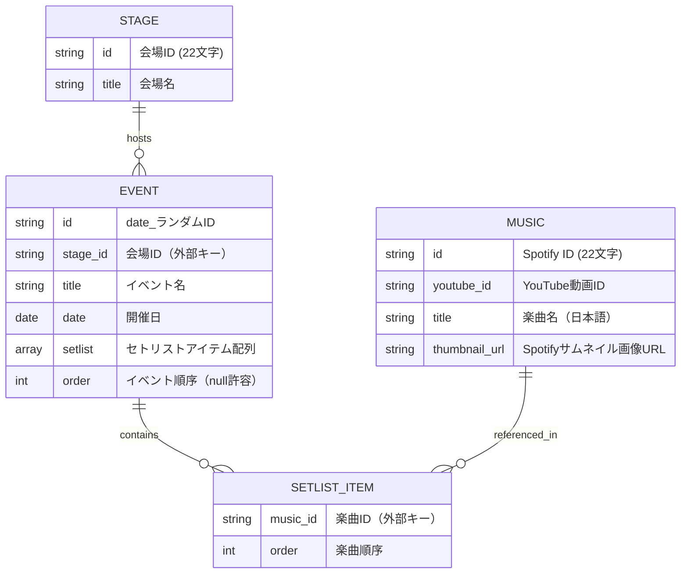

## 現在実装されている画面構成

### 主要画面

- **セトリページ** (`setlist_page.dart`) - イベントリストを表示
  - イベントごとのセトリストをカード形式で表示
  - イベント名、日付、会場情報を表示
  - セトリストの楽曲をチップ形式で表示
  - 共有ボタンによるイベント情報共有機能

- **セトリ詳細ページ** (`setlist_detail_page.dart`) - 特定イベントのセトリスト詳細
  - 選択したイベントの詳細情報
  - セトリストの楽曲順序表示
  - 楽曲から楽曲詳細への遷移

- **楽曲詳細ページ** (`music_detail_page.dart`) - 楽曲の詳細情報
  - 楽曲の基本情報（タイトル、サムネイル）
  - その楽曲が使用されたイベント一覧
  - YouTube再生機能
  - 共有機能

### 設定画面

- **設定ページ** (`settings_page.dart`) - アプリケーション設定
- **カスタムライセンスページ** (`custom_license_page.dart`) - ライセンス情報表示

## データ構造

### 入力データ

#### フォーマット

```txt 入力データフォーマット
<実施日> <曜日> <会場名>
『<イベント名>』

<SE_Music>
1. <Music_1>
2. <Music_2>
```

#### 例

```txt 入力データ例
2025.8.7 Thu. 大阪Anima
『IDO-LIVE!! EXTREME』

(SE)To The Deep World
1. サイノメ
2. STARDUST
3. BINARY NUMBER
4. GHOST
5. デスパレードグローリーデイズ
6. 1ミリの勇気
```

### モデル



※ Spotify側のidが22文字で構成されているため、本アプリ全体の共通仕様としてidは22文字とする

### 現在実装されているデータモデル

- **楽曲モデル** (Music)
  - id: Spotify ID (22文字)
  - youtube_id: YouTube動画ID
  - title: 楽曲名（日本語）
  - thumbnail_url: Spotifyサムネイル画像URL

- **会場モデル** (Stage)
  - id: 会場ID (22文字、ランダム生成)
  - title: 会場名

- **イベントモデル** (Event)
  - id: イベントID (22文字、ランダム生成)
  - stage_id: 会場ID（外部キー）
  - title: イベント名
  - date: 開催日
  - setlist: セトリストアイテムの配列
    - music_id: 楽曲ID
    - order: 楽曲順序
  - order: イベント順序（null許容）

### 実際に保存されているJSONファイル

プロジェクト内の `app/assets/` ディレクトリに以下のJSONファイルが配置されています：

- **music.json** - 楽曲データ
- **stage.json** - 会場データ
- **event.json** - イベントデータ（セトリスト情報を含む）

## アーキテクチャ構成

### Riverpod Repositoryパターン

現在の実装では、各データモデルに対応するRepositoryクラスを使用：

- **MusicRepository** (`music_repository.dart`)
  - アセットから `music.json` を読み込み
  - 楽曲の取得、複数楽曲の順序付き取得機能
  - `@Riverpod(keepAlive: true)` による永続化

- **StageRepository** (`stage_repository.dart`)
  - アセットから `stage.json` を読み込み
  - イベントIDから対応する会場を取得する機能
  - EventRepositoryとの連携

- **EventRepository** (`event_repository.dart`)
  - アセットから `event.json` を読み込み
  - イベントの取得、楽曲IDからのイベント検索機能
  - セトリスト情報の管理

### サービス層

- **SetlistService** (`setlist_service.dart`)
  - セトリスト関連のビジネスロジック
  - リポジトリ間の連携処理

### その他のサービス

- **FirebaseAnalyticsService** - アナリティクス機能
- **WebTitleService** - Web版のタイトル管理
