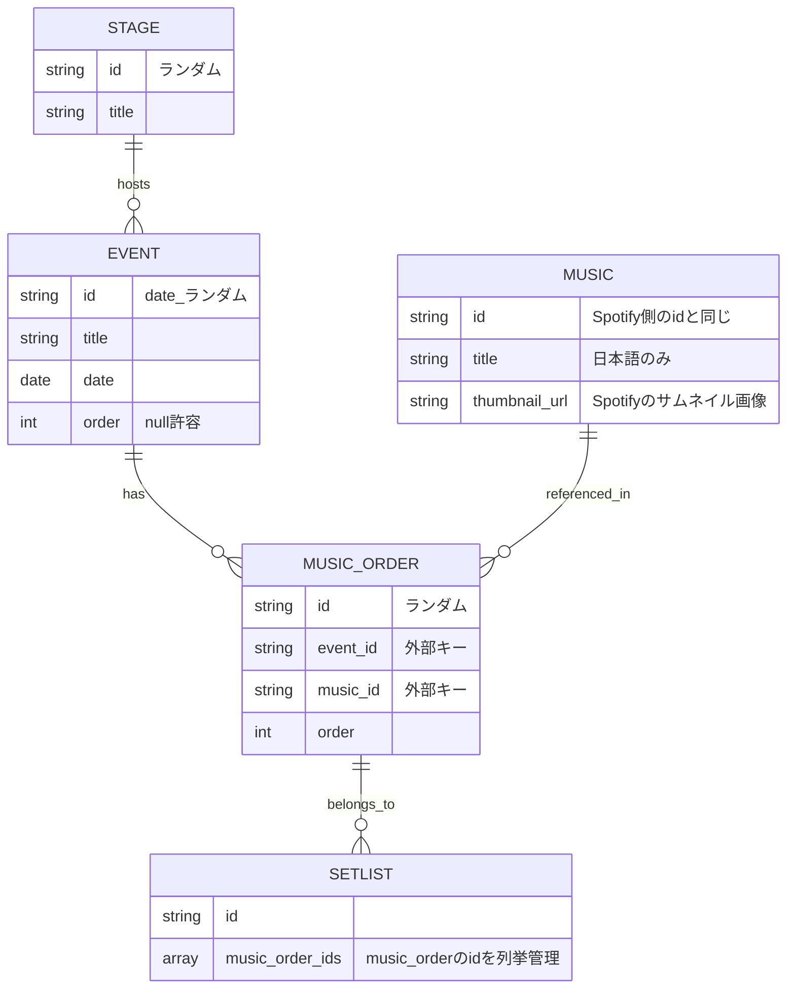

## MVP

- 画面
  - 楽曲が一覧表示された画面(music_list_page)
    - リストアイテム(music_list_tile)
      - leading: サムネイルを表示
      - title: 楽曲名
      - subtitle: セトリ採用合計数
      - threeline: 直近で実施されたイベント名
      - action: 再生ボタンを押下したら、(Spotifyで)再生 or Spotifyの画面を開きたい
  - 楽曲詳細画面(music_details_page)
    - 再生ボタンを押下したら、(Spotifyで)再生 or Spotifyの画面を開きたい
    - サムネイルを表示
    - セトリ採用合計数
    - 直近で実施されたイベント名
    - セトリに採用されたイベントをリスト表示(setlist_page)
      - music_idを指定し、music_idが一致した内容のみを表示するようにフィルタリングする
      - リストアイテム
        - title: イベント名
        - subtitle: 日付 / 会場
        - threeline: 同じセトリの楽曲を表示
          - チップ表示し、押下したら紐づいた別の楽曲詳細画面に遷移
          - カレントの楽曲に関しては、グレーアウトし押下できないようにする
  - セトリに採用されたイベントをリスト表示(setlist_page)
    - リストアイテム
      - title: イベント名
      - subtitle: 日付 / 会場
      - threeline: 同じセトリの楽曲を表示
        - チップ表示し、押下したら紐づいた別の楽曲詳細画面に遷移
        - カレントの楽曲に関しては、グレーアウトし押下できないようにする

## データ構造

### 入力データ

#### フォーマット

```txt 入力データフォーマット
<実施日> <曜日> <会場名>
『<イベント名>』

<SE_Music>
1. <Music_1>
2. <Music_2>
```

#### 例

```txt 入力データ例
2025.8.7 Thu. 大阪Anima
『IDO-LIVE!! EXTREME』

(SE)To The Deep World
1. サイノメ
2. STARDUST
3. BINARY NUMBER
4. GHOST
5. デスパレードグローリーデイズ
6. 1ミリの勇気
```

### モデル



※ Spotify側のidが22文字で構成されているため、本アプリ全体の共通仕様としてidは22文字とする

- 楽曲データモデル(music)
  - id
    - Spotify側のidと同じにする
  - title
    - 日本語のみにする
  - thumnail_url
    - Spotifyのサムネイル画像を格納する
- 会場モデル(stage)
  - id
    - ランダム
  - title
- イベントモデル(event)
  - id
    - <date>\_ランダム
  - title
  - date
  - order
    - null許容
- 楽曲順モデル(music_order)
  - id
    - ランダム
  - event_id
  - music_id
  - order
- セトリモデル(setlist)
  - id
  - music_order_ids
    - music_orderのidを列挙管理

### プロジェクトないに保存するJSON

- music.json
- stage.json
- event.json
- music_order.json

## Data Notifier

- music_notifier
  - 初期化処理
    - `music.json`を読み込み、Mapオブジェクトに変換
    - Map -> List<Music>にパース
    - stateとしてList<Music>を格納
  - データを永続化
- stage_notifier
  - 初期化処理
    - `stage.json`を読み込み、Mapオブジェクトに変換
    - Map -> List<Stage>にパース
    - stateとしてList<Stage>を格納
  - データを永続化
- event_notifier
  - 初期化処理
    - `event.json`を読み込み、Mapオブジェクトに変換
    - Map -> List<Event>にパース
    - stateとしてList<Event>を格納
  - データを永続化
- music_order_notifier
  - 初期化処理
    - `music_order.json`を読み込み、Mapオブジェクトに変換
    - Map -> List<MusicOrder>にパース
    - stateとしてList<MusicOrder>を格納
  - データを永続化
- setlist_notifier
